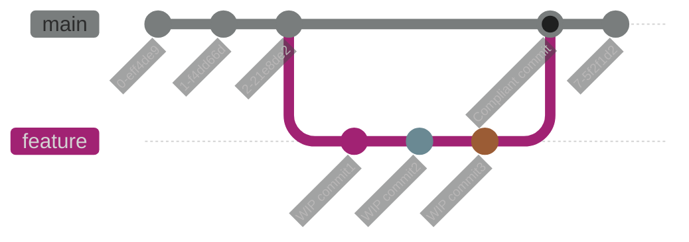

This will be a short post about a nifty feature I found in `lazygit`. Strangely, I have not ran into projects enforcing specific git messages that much. But things have changed and it did not take long before it started to annoy me and I had to look for solutions.

<!--more-->

So lets just go through the premiss real quickly, you're on your feature branch and the code is flowing. You go to commit, and you cant! You're enforced to follow the strict pre-commit hook setup for the project. This is fine, and actually really good practice to keep a nice coherent history of what exactly is going on. Buuut... If you're anything like me, you like to commit often and small individual pieces to sort of organize things for yourself, while you're working. If you do that, these commit-hooks get annoying unless you take some actions.



The first thing I did for quite some time was:

```bash
git commit --no-verify -m "yadda yadda my awesome commit"
```

And once a feature feels done and you're feeling ready to push simply do a `rebase -i`, squash it all and concoct your beautiful compliant commit at this point.
This actually works fine, and with `alias` it is even better. But it does not fit how i work with `lazygit`.

So I went digging a bit and I found this in the docs:

```yaml
# Prefix to use when skipping hooks. E.g. if set to 'WIP', then pre-commit hooks will be skipped when the commit message starts with 'WIP'
skipHookPrefix: WIP
```

duh! And I felt so stupid. Of course it is so simple!

Moral of this story is, `rebase` often, WIP `commit` often (this is so helpful imho) and only worry about that pretty commit message when you're all done!
