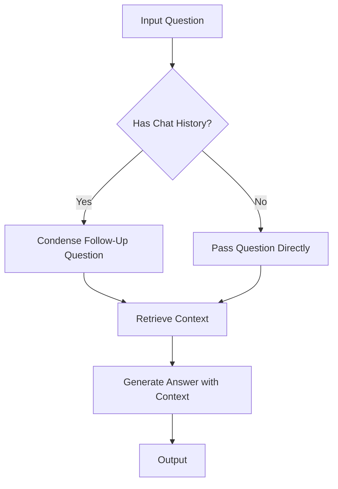

Once the data is prepared and stored in a graph database, the next step is to make it usable. For **gRAG**, this meant building an application layer capable of retrieving and generating insightful, context-rich responses. At the core of this application is **LangChain**, a framework that seamlessly integrates retrieval and generation workflows.

<!--more-->

This post focuses on how the application layer connects users to the Neo4j database, enabling advanced RAG capabilities. From querying relationships in the graph to generating user-friendly responses, the app showcases the potential of combining graph-based retrieval with language models.

## The Application

The application uses `chainlit` for the frontend, mounted as a `FastAPI` endpoint. Why `chainlit` over `streamlit`? Honestly, it boils down to familiarity—either one would have been fine, but I stuck with what I knew.

As long as I can avoid writing JavaScript, I’m happy. `chainlit` delivers a clean, interactive chat GUI with plenty of options, all configurable from within Python. That’s a win in my book.

### **Structure**

Here’s the overall structure of the app:

```bash
app
├── __init__.py
├── __main__.py
├── cl_app.py
├── main.py
├── api
│   ├── __init__.py
│   ├── endpoints
│   │   ├── __init__.py
│   │   └── chat.py
│   └── routes.py
├── core
│   ├── __init__.py
│   └── config.py
└── util
    ├── __init__.py
    ├── agent.py
    ├── chains.py
    ├── llm.py
    ├── ollama_functions.py
    ├── retrievers.py
    ├── tools.py
    └── prompts
        ├── __init__.py
        ├── entities.py
        ├── rag.py
        ├── react.py
        └── summary.py
```

I’m not going to dive into every single part of the structure—some components aren’t particularly exciting or fully implemented yet, while others are worth discussing in detail. For example, I’ll skip over the `api` directory for now. The original idea was to serve various chains as endpoints, but there isn’t much to show at this point. It’s one of those _"someday, maybe"_ features that I’d love to flesh out when time permits. The same goes for agents: the groundwork is there, but it’s not a priority right now.

With that said, the core components I want to highlight are:

- **Prompts**
- **Chains**
- **Retrievers**
- **Managing LLMs**

There’s a lot to unpack, so let’s get into it!

### Prompts

Prompts are at the core of any GenAI-powered application. For those unfamiliar, a prompt is essentially what you ask the AI to do—it’s the input that guides its output. The way you craft a prompt can make or break the results you get, whether you’re summarizing text, answering questions, or generating something creative.

In the project there is more prompts defined than I'll actually talk about, we'll focus only on RAG related prompts, starting off with named entity recognition (NER).

#### NER

In order to extract data with a structured retriever, e.g., finding stuff among the nodes and relationships in the graph database we need to extract concrete searchable terms and disregard everything else.

Imagine we have a graph database that contains nodes for **Projects**, **Teams**, and **Technologies** with relationships like "uses," "managed by," and "contributed to."

##### **User Question**

_"Which projects use Python and are managed by the AI Team?"_

##### **Extraction Process**

To make this query effective in a structured retriever, we extract only the key terms that are relevant for searching the graph:

- **Concrete Terms (Searchable Keywords):**
  - `Python` (Technology)
  - `AI Team` (Team)
  - `uses` (Relationship)
  - `managed by` (Relationship)

##### **Disregarded Terms:**

- Articles, prepositions, or general phrases like _"Which," "and are," "by the."_

Its Really quite simple but effective and here it is in practice:

```python
messages = ChatPromptTemplate.from_messages(
    [
        (
            "system",
            "You are extracting pronoun entities from the text, such as people, places, and organizations. If the entities are not in english, translate to english.",
        ),
        (
            "human",
            "Use the given format to extract information from the following "
            "input: {input}",
        ),
    ]
)
```

#### RAG

In any RAG system, structuring prompts effectively is key to ensuring seamless interaction between the conversational interface, retrievers, and the LLM. Below, I’ll explain how I set up prompts to handle follow-up questions, integrate chat history, and generate context-aware responses.

##### 1. **Rephrasing Follow-Up Questions**

When a user asks follow-up questions, they often rely on prior context. To ensure our retriever works efficiently, we need to convert follow-up queries into standalone questions that encapsulate the necessary context.

Here’s the prompt template for this task:

```python
_template = """Given the following conversation and a follow up question, rephrase the follow up question to be a standalone question,
in its original language, which is English.
Chat History:
{chat_history}
Follow Up Input: {question}
Standalone question:"""  # noqa: E501

CONDENSE_QUESTION_PROMPT = PromptTemplate.from_template(_template)
```

For example:

**Input:**

```plaintext
Chat History:
1. User: What are the symptoms of flu?
2. Assistant: Common symptoms include fever, cough, and fatigue.
3. User: How do I treat it?
```

**Rephrased Question:**

```plaintext
How do I treat flu?
```

By rephrasing, the system can independently process the query, enabling accurate retrieval and generation.

##### 2. **Formatting Chat History**

To process chat history effectively, we need to ensure it’s in a consistent, clean format. The `_format_chat_history` function handles this by iterating through the chat messages and extracting their content.

```python
def _format_chat_history(chat_history: list[BaseMessage]) -> list:
    buffer = []
    for message in chat_history:
        if isinstance(message, HumanMessage):
            buffer.append(message.content)
        elif isinstance(message, AIMessage):
            buffer.append(message.content)
        else:
            logger.warning(f"Unexpected message type in chat_history: {type(message)}")
    return buffer
```

This ensures only meaningful content is passed to the rephrasing prompt.

**Example Input:**

```python
chat_history = [
    HumanMessage(content="What are the symptoms of flu?"),
    AIMessage(content="Common symptoms include fever, cough, and fatigue."),
]
```

**Output:**

```python
["What are the symptoms of flu?", "Common symptoms include fever, cough, and fatigue."]
```

##### 3. **Branching Logic with `RunnableBranch`**

The system needs to handle two scenarios:

1. If chat history exists, condense the follow-up question with the context.
2. If no chat history exists, directly use the input question.

Here’s how `RunnableBranch` dynamically handles this:

```python
_search_query = RunnableBranch(
    (
        RunnableLambda(lambda x: bool(x.get("chat_history"))),  # Check for chat history
        RunnablePassthrough.assign(
            chat_history=lambda x: _format_chat_history(x["chat_history"])
        )
        | CONDENSE_QUESTION_PROMPT  # Condense follow-up question
        | llm.get_llm_instance()
        | StrOutputParser(),
    ),
    # Pass through question directly if no chat history
    RunnableLambda(lambda x: x["question"]),
)
```

**Example Behavior:**

1. **With Chat History:**
   - Input: Chat history + follow-up question.
   - Output: Standalone question.
2. **Without Chat History:**
   - Input: Question only.
   - Output: Same question.

##### 4. **Query Template for Contextual Answers**

After rephrasing the question, the system retrieves relevant context from the knowledge graph. The following prompt guides the LLM to generate an answer based solely on the provided context:

```python
template = """Answer the question based only on the following context:
{context}

Question: {question}
Use natural language and be detailed and concise.
Answer:"""

messages = ChatPromptTemplate.from_template(template)
```

**Example Input:**

```python
context = "Flu is caused by influenza viruses and spreads easily. Common treatments include rest, hydration, and antiviral medications."
question = "How do I treat flu?"
```

**Generated Answer:**

```plaintext
Flu can be treated by getting plenty of rest, staying hydrated, and taking antiviral medications if prescribed by a doctor.
```

##### 5. **Flow of the System**

Here’s a simplified flow of how everything ties together:

1. **Input:** User query (+ optional chat history).
2. **Processing:**
   - Rephrase follow-up questions (if chat history exists).
   - Retrieve context from the knowledge graph.
3. **Output:** Detailed, contextually relevant answer.

##### Visualizing the Flow



Next up, retrievers!

### Retrievers

Retrievers interact with a graph database and a vector-based search index to extract both structured and unstructured information.

#### 1. **Structured Retriever**

The **structured retriever** is multi facetted and designed to fetch neighborhood entities from a graph database based on the input query. It uses the Neo4j full-text index and relationships between nodes to extract relevant context.

##### Key Components:

- **NER:** Extracts entities from the input query using the `get_ner_chain`.
- **Query Generation:** Constructs a Lucene-compatible query string using `_generate_full_text_query`, similarity threshold (~2 changed characters) to each word.
- **Graph Query Execution:** Executes a Cypher query on Neo4j to fetch related nodes and relationships.

##### Code Highlights:

```python
def structured_retriever(question: str) -> str:
    store = get_default_store()
    entities = get_ner_chain().invoke({"input": question})

    for entity in entities.names:
        query = """
        CALL db.index.fulltext.queryNodes('entity', $query, {limit:2})
        YIELD node, score
        CALL {
            WITH node
            MATCH (node)-[r:!MENTIONS]->(neighbor)
            RETURN ...
            UNION ALL
            MATCH (node)<-[r:MENTIONS]-(neighbor)
            RETURN ...
        }
        RETURN output LIMIT 50
        """
        response = store.graph.query(query, {"query": _generate_full_text_query(entity)})
        result += "\n".join([el["output"] for el in response])
    return result
```

##### Example Input and Output:

- **Input Question:** "Who are the key collaborators on Project X?"
- **Entities Extracted:** `["Project X"]`
- **Structured Output:**
  ```plaintext
  Node: (id: 1, description: Project X) -[MENTIONS]-> (id: 2, description: John Doe)
  (id: 3, description: Jane Doe) -[MENTIONS]-> (id: 1, description: Project X)
  ```

#### 2. **Hybrid Retriever**

The **hybrid retriever** combines vector-based semantic search with keyword-based matching.

##### Code Highlights:

```python
def hybrid_retriever() -> Neo4jVector:
    store = get_default_store()
    return store.vectorstore.from_existing_index(
        store.embeddings, index_name="vector", keyword_index_name="keyword"
    )
```

##### Key Steps:

1. **Vector Search:** Finds the most semantically similar documents or nodes using `similarity_search`.
2. **Keyword Matching:** Complements vector search with keyword-based retrieval for enhanced precision.

##### Example Usage:

- **Input Query:** "Benefits of AI in healthcare"
- **Output:** A ranked list of semantically similar documents, e.g.:
  ```plaintext
  #Document AI and Healthcare: Transforming patient care with technology...
  #Document Benefits of Artificial Intelligence in clinical research...
  ```

#### 3. **Super Retriever**

The **super retriever** is a composite retriever that combines the outputs of the structured and hybrid retrievers into a unified result. It’s designed to handle both structured graph data and unstructured document data simultaneously.

##### Code Highlights:

```python
def super_retriever(question: str) -> str:
    structured_data = structured_retriever(question)
    hybrid_result = hybrid_retriever().similarity_search(question, k=2)
    unstructured_data = [el.page_content for el in hybrid_result]

    final_data = f"""Structured data:
    {structured_data}
    Unstructured data:
    {"#Document ".join(unstructured_data)}
   """
    return final_data
```

##### Example Input and Output:

- **Input Question:** "What collaborations exist for AI research?"
- **Output:**
  ```plaintext
  Structured data:
  Node: (id: 4, description: AI Research) -[MENTIONS]-> (id: 5, description: University of XYZ)
  Unstructured data:
  #Document AI Research Collaboration Report 2023...
  #Document Advances in AI and partnerships...
  ```

#### Why Retrievers Matter

Retrievers bridge the gap between raw user queries and actionable information. By combining structured graph data with unstructured content, the system ensures comprehensive and contextually relevant results.

In the next section, we’ll explore how **prompts and retrievers integrate with the Chains** to build a seamless retrieval-to-response pipeline.

### Chains

Each chain is a modular pipeline designed to handle a specific type of operation, like NER or RAG. Let’s dive into the details of these chains.

#### 1. **NER Chain**

The **NER Chain** extracts structured entities from unstructured text. This chain uses a language model to identify and categorize entities such as people, organizations, dates, and more.

**Code Implementation:**

```python
def get_ner_chain(llm_settings: Optional[LLMSettings] = None) -> Runnable:
    from app.util import get_llm_instance, get_ollama_instance, prompts

    settings = llm_settings or config.LLM_SETTINGS
    logger.info(f"settings :: {settings}")

    if settings.provider == "ollama":
        llm = get_ollama_instance(settings)
    else:
        llm = get_llm_instance(settings)

    return prompts.entities.messages | llm.with_structured_output(
        prompts.entities.Entities
    )
```

**Key Steps:**

1. **LLM Selection:** Based on the configuration (`ollama` or another provider), the appropriate LLM instance is initialized.
2. **Prompting:** The chain uses a predefined prompt discussed earlier (`prompts.entities.messages`) to guide the model on extracting entities.
3. **Structured Output:** The output is parsed into a structured format using `with_structured_output`.

#### 2. **RAG Chain**

The **RAG Chain** combines retrieval and generation to provide contextually relevant answers. It retrieves information from the knowledge graph or external sources and generates a detailed response.

**Code Implementation:**

```python
def get_rag_chain(llm_settings: Optional[LLMSettings] = None) -> Runnable:
    from app.util import get_llm_instance, prompts, retrievers

    return (
        RunnableParallel(
            {
                "context": prompts.rag._search_query | retrievers.super_retriever,
                "question": RunnablePassthrough(),
            }
        )
        | prompts.rag.messages
        | get_llm_instance(llm_settings)
        | StrOutputParser()
    )
```

**Key Steps:**

1. **Parallel Processing:**
   - The chain runs two tasks in parallel:
     - **Retrieve Context:** The `_search_query` prompt is processed, and results are retrieved using `super_retriever`.
     - **Process Question:** The original question is passed through unchanged.
2. **Combining Context and Question:** These are then fed into a generation prompt (`prompts.rag.messages`) to produce a detailed answer.
3. **LLM Execution:** The query is processed by the selected LLM instance.
4. **Output Parsing:** The result is parsed into a string format.

**Example Input:**

- **Question:** "What are the benefits of the flu vaccine?"
- **Retrieved Context:**
  ```plaintext
  "The flu vaccine reduces the risk of flu-related illnesses, hospitalizations, and deaths. It is particularly beneficial for high-risk groups."
  ```

**Output:**

```plaintext
"The flu vaccine reduces the risk of flu-related illnesses, hospitalizations, and deaths. It is particularly beneficial for high-risk groups like the elderly and those with chronic conditions."
```

#### Why Chains Matter

Chains streamline the application's operations, ensuring that each task (e.g., NER or RAG) is handled efficiently and independently. They allow for modularity, making it easier to extend or modify individual components without disrupting the overall system.

So we've just about covered all major topics by now and multiple times throughout these we have seen `get_llm_instance(llm_settings)`, lets have a look what is happening here behind the scenes:

### Managing LLMs

Working with LLMs? It can get messy fast. Different providers, configurations, and quirks—it’s a lot. That’s why I use a centralized manager to keep things clean and flexible.

#### **The LLMClientManager**

The `LLMClientManager` is how I manage LLM clients efficiently. Here’s what it handles:

1. **Single Instances**: One client per provider, reused across your app. No duplicates.
2. **Dynamic Configs**: Pass in custom settings or rely on app defaults.
3. **Provider-Specific Logic**: Handles edge cases (hello, Ollama).

Example usage:

```python
llm_client = LLMClientManager.get_instance()
# Reuses the same instance
another_client = LLMClientManager.get_instance()
assert llm_client is another_client  # True
```

#### **Built for Flexibility**

The standard client supports all OpenAI-compatible APIs with minimal setup:

```python
options = {
    "base_url": provider["base_url"],
    "api_key": provider["api_key"],
    "model": settings.model,
    "temperature": settings.temperature,
}
return ChatOpenAI(**options)
```

Switching models or providers? Just update your config—no rewiring required.

#### **Ollama: The Edge Case**

For edge cases like Ollama, I had to create a separate client:

```python
if settings.provider == "ollama":
    options = {
        "base_url": config.OLLAMA_API_BASE,
        "model": settings.model,
        "temperature": settings.temperature,
    }
    return OllamaFunctions(format="json", **options)
```

This client setup enables `function_calling` for ollama models.
It’s not ideal, but it works. For everything else, the standard client does the heavy lifting.

#### **Why It Matters**

This setup simplifies LLM management:

- **Efficient**: One instance per client saves resources.
- **Flexible**: Switch providers or tweak settings with ease.
- **Clean**: A single interface keeps logic organized.

If you’re working with multiple LLMs, this approach is worth a shot. It keeps things simple, so you can focus on building cool stuff 🚀

## Closing Thoughts

With the ingestion pipeline and application layer in place, gRAG is a powerful demonstration of how graph databases can enhance retrieval-augmented generation systems. If you’ve made it this far, I’d love to hear your thoughts or see how you might extend this idea in your own projects.

gRAG’s application layer is a bridge between advanced data retrieval and accessible user insights. It’s not just about delivering answers but doing so with depth, accuracy, and context.

If you’d like to dive deeper into the technical details, check out the [GitHub repository](https://github.com/mattjh1/gRAG).
