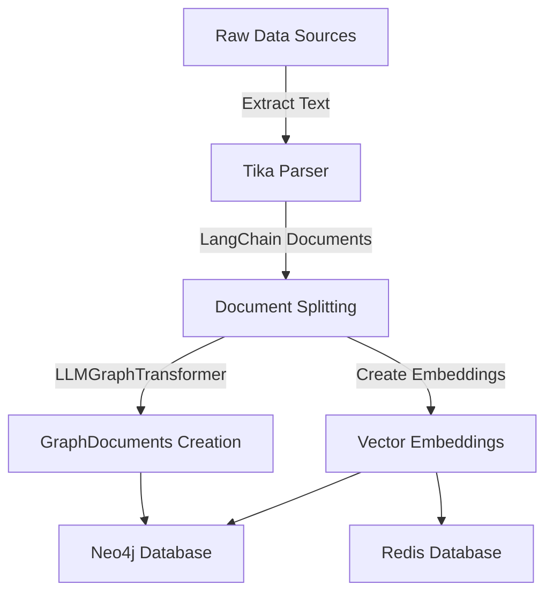
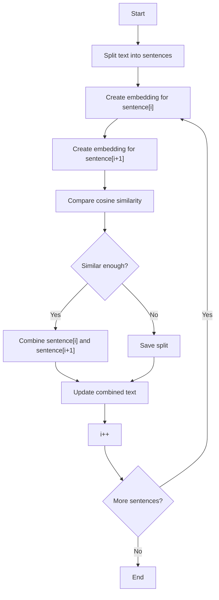

Retrieval-Augmented Generation (RAG) systems start with a simple but critical requirement: data. But not just any data—it needs to be clean, structured, and primed for meaningful retrieval and generation. With **gRAG**, my experimental take on RAG, I set out to explore what happens when you introduce a graph database like Neo4j into the mix.

<!--more-->

This wasn’t about reinventing the wheel—it was more of a personal journey to see how far I could push the boundaries of traditional RAG setups. Could a graph database uncover relationships that enhance retrieval? Could it offer context that a typical vector store might miss? These were the questions driving my work, and they shaped the design of an ingestion pipeline that bridges the gap between raw, unstructured data and a graph-powered system for smarter retrieval.

The goal? Build a system that doesn’t just _find_ answers—it understands the context around them.

At the heart of this effort is the **ingestion pipeline**: a series of steps designed to extract meaning from raw, messy data and transform it into a structured format. For gRAG, this meant combining tools like Apache Tika for text extraction, Ollama for embedding creation, and Neo4j for relationship-driven storage—all orchestrated to unlock the power of graph-based retrieval.

Here’s how the pipeline came together, the challenges it addressed, and why I believe graphs are the missing piece in traditional RAG setups.

## Ingestion Pipeline

A crucial component of any RAG application is preparing data for the retriever. This involves extracting, parsing, splitting, and storing data in a format optimized for search and retrieval. My pipeline implements this process efficiently, leveraging a combination of Python tools and libraries.

Here’s an overview of the flow:



Here's some noteworthy details about the setup:

- **CLI Implementation with Click**  
  The pipeline is implemented as a CLI application using **Click**. This provides a clean, user-friendly interface for running the pipeline. Commands are modular, allowing users to run specific stages (e.g., only embedding creation or graph storage).

- **Efficiency with `yield`**  
  To handle large datasets without overwhelming memory, the pipeline uses **Python generators** (`yield`). For example, text chunks are generated and processed on the fly during splitting and embedding creation. This design ensures memory efficiency, even with massive datasets.

- **Progress Tracking with `tqdm`**  
  For better visibility into the processing flow, **tqdm** is used to track progress. Each major step in the pipeline (e.g., file parsing, splitting, embedding creation) provides a live progress bar, giving users immediate feedback.

- **Checksum-Based Metadata**  
  To avoid redundant work, the pipeline saves a **checksum** of each processed file in the metadata of the LangChain documents. Before processing, it compares the current file’s checksum to the saved one, skipping files that haven’t changed. This saves time and computational resources.

### Tika Parser

Apache Tika is an absolute powerhouse for file parsing, and what really sets it apart is its versatility—it handles just about any file format you can throw at it. This makes it a favorite tool in many big-name applications like Lucene/Solr, ElasticSearch, and Hadoop, to name a few.

At its core, Tika is a content detection and extraction library that processes a huge variety of file formats to pull out text, metadata, and structured content. Under the hood, it uses specialized parsers to handle everything from PDFs and Microsoft Office documents to images. What’s great is that it wraps all of this up in a unified API, making it super easy to work with.

For this project, I deployed Tika as a container using Docker Compose. This setup lets my pipeline hit its REST API for seamless file parsing without worrying about configuring the Java-based environment. With the help of the `tika-python` library, it’s a breeze to interact with Tika directly from Python. The library abstracts the API calls, so extracting text and metadata becomes as simple as a function call. It's quick, efficient, and integrates perfectly into my ETL pipeline.

```python
def parse_file_content(content: bytes) -> Optional[Document]:
    if len(content) <= 0:
        return None
    result = parser.from_buffer(
        content,
        serverEndpoint=TIKA_SERVER_URL,
    )
    result = cast(dict, result)
    text = result["content"]
    if text is None:
        return None
    checksum = get_checksum(content)
    doc = Document(
        page_content=text,
        metadata={"content_checksum": checksum},
    )
    logger.info(f"Full doc len :: {len(doc.page_content)} chars")
    return doc

```

### Splitting Strategy

The next step in the pipeline is splitting large sections of text into smaller, more manageable pieces suitable for embeddings. Over time, I’ve experimented with several splitting strategies, ranging from simple to complex. These approaches can be categorized into different levels based on their sophistication.

1. **Level 1: Character Splitting**  
   This is the most basic approach: set a size limit and an overlap. The overlap helps mitigate the problem of splitting a single piece of context across multiple chunks. However, this method is incredibly naive—it completely disregards the structure and meaning of the text, often resulting in awkward and fragmented chunks.

2. **Level 2: Recursive Splitting**  
   Taking it up a notch, recursive splitting respects text structure by considering separators like paragraph breaks, newlines, or even spaces. You still specify a size and overlap, but the chunk size can adjust slightly to align with these natural breakpoints. For most use cases, this strategy is both effective and sufficient.

3. **Level 3: Context-Aware Splitting**  
   This method shines for content where arbitrary splitting would render embeddings useless—think source code, where splitting a function in half would be catastrophic for meaning. Instead, we can parse and split by known segments, such as functions in code. For instance:
   - One chunk per function.
   - One chunk for the entire file, but only containing imports, global variables, and function declarations (omitting their bodies).  
     This approach ensures chunks are logical and semantically intact, preserving their usefulness.

But then there’s the next level—one that I had been eager to explore ever since I discovered it: **Semantic Splitting**.

Semantic splitting immediately intrigued me because it aligns with my ultimate goal: transforming chunks into a graph database without fragmentation. Addressing the fragmentation problem during this early phase was an obvious choice.

#### What is Semantic Splitting?

Semantic splitting can be summarized as:



Unlike other strategies, this method compares the meaning of consecutive sentences using cosine similarity. When two sentences are deemed similar enough, they’re combined into a single chunk. If not, the split is saved, and the process continues. This results in chunks that are semantically meaningful and contextually cohesive.

#### Why I Love This Approach

If this sounds exciting, you’re not alone. When I learned about this technique, I couldn’t wait to try it. Luckily, someone had already done the hard work! Greg Kamradt’s excellent [notebook](https://github.com/FullStackRetrieval-com/RetrievalTutorials/blob/main/tutorials/LevelsOfTextSplitting/5_Levels_Of_Text_Splitting.ipynb) dives deep into this topic, introducing the concept in a way that’s both insightful and practical. Even better, someone implemented his algorithm in `LangChain`, saving me hours or maybe days of work. Now all I have to do is this:

```python
def semantic_split(doc: Document) -> list[Document]:
    from data.store import get_default_store

    store = get_default_store()
    """Semantic splitter of text using cosine similarity of sentences to set chunk size"""
    semantic_text_splitter = SemanticChunker(
        store.embeddings, breakpoint_threshold_type="percentile"
    )
    """Split using semantic similarity"""
    chunks = semantic_text_splitter.split_documents([doc])
    return chunks
```

Pretty sweet, right? With just a few lines of code, I get chunks that are not only compact but also semantically rich and ready for downstream tasks.

### Graph Generation

Now that we’ve tackled splitting the text into meaningful chunks, the next step is something I find even more exciting: **Graph Generation**. This is where we start weaving those chunks into a rich, interconnected structure that can power more advanced analyses and queries. Imagine turning raw text into a web of relationships—nodes, edges, and properties—all ready to be queried in a graph database like Neo4j.

The core of this process involves converting text chunks into **GraphDocuments**, which are specialized data structures designed for representing knowledge graphs. Here’s how it works under the hood.


`LLMGraphTransformer` incur costs by being dependent on high performant LLMs like gpt-4o or claude and utilizing `function_calling` to generate graph docs. For reference, I created a graph using this strategy with the entirety of Bram Stoker's Dracula novel (418 pages), it cost ~$30


#### Turning Documents Into Graphs

At the heart of the transformation is the `process_document` function:

```python
def process_document(
    document: Document, llm_transformer: LLMGraphTransformer
) -> list[GraphDocument]:
    return llm_transformer.convert_to_graph_documents([document])
```

This function takes a document and an `LLMGraphTransformer` instance. The transformer leverages a language model to extract nodes, relationships, and properties from the text, packaging them into a graph-friendly format.

But what about scaling this up for multiple documents? Enter the `as_graph_documents` function:

```python
def as_graph_documents(
    page: Path, settings: GraphTransformerSettings = default_settings
) -> list[GraphDocument]:
    """Convert files at paths to LangChain GraphDocument objects."""
    from app.util import get_llm_instance

    docs = parse_file(page)
    if not docs:
        return []

    llm = get_llm_instance()
    llm_transformer = LLMGraphTransformer(
        llm=llm,
        allowed_nodes=settings["allowed_nodes"],
        allowed_relationships=settings["allowed_relationships"],
        node_properties=settings["node_properties"],
        relationship_properties=settings["relationship_properties"],
    )

    max_workers = 10
    graph_documents = []
    with ThreadPoolExecutor(max_workers=max_workers) as executor:
        futures = [
            executor.submit(process_document, doc, llm_transformer) for doc in docs
        ]

        for future in tqdm(
            as_completed(futures),
            total=len(futures),
            desc="Processing documents for Neo4j",
        ):
            try:
                graph_document = future.result()
                graph_documents.extend(graph_document)
            except Exception as e:
                logger.error(f"Error processing document: {e}")

    return graph_documents
```

Here’s what’s happening:

1. **Parse the Input**: The documents are parsed from the given file path.
2. **Set Up the Transformer**: An `LLMGraphTransformer` is initialized with language model settings and graph-specific rules like allowed nodes and relationships.
3. **Parallel Processing**: Using a thread pool, documents are processed concurrently, making this workflow efficient for large datasets.
4. **Error Handling**: Any issues during transformation are logged, so no single failure disrupts the entire batch.

By the end of this function, we have a list of graph documents ready to be loaded into a graph database with a simple cypher.

### Graph Storage and Indexing

Once we’ve processed documents into graph-friendly structures, the next step is storing and indexing the graph. This makes the data ready for querying and retrieval.

#### Storing the Graph

The `store_graph` method handles the insertion of graph documents into the database. It not only adds the graph structure but also sets up schema-related elements for efficient querying:

```python
def store_graph(self, docs: list[GraphDocument]) -> None:
    self.graph.add_graph_documents(docs, baseEntityLabel=True, include_source=True)
    self.graph.query(
        "CREATE FULLTEXT INDEX entity IF NOT EXISTS FOR (e:__Entity__) ON EACH [e.id]"
    )
    self.graph.refresh_schema()
    logger.info(f"Graph schema :: {self.graph.schema}")
```

Here’s what’s happening:

1. **Add Documents**: The `add_graph_documents` method loads the graph documents, linking entities and their relationships while preserving source information.
2. **Create Full-Text Index**: A full-text index is created (if it doesn’t already exist) on the entity ID, allowing for fast lookup and query performance.
3. **Refresh Schema**: After adding documents and indexes, the schema is refreshed to ensure the graph database is up-to-date.
4. **Logging**: The schema details are logged for verification and debugging purposes.

#### Enriching Graphs with Embeddings

The final step in this process is to utilize the sources stored in the graph—specifically, the nodes labeled as `Document`. This is accomplished through the `as_vectors_from_graph` function, which sets up two indices: one for vector-based search and another for keyword-based search.

```python
def as_vectors_from_graph(emb_model: Embeddings):
    from data.store import get_default_store

    store = get_default_store().vectorstore
    store.from_existing_graph(
        emb_model,
        search_type=SearchType.HYBRID,
        node_label="Document",
        text_node_properties=["text"],
        embedding_node_property="embedding",
        index_name=os.getenv("NEO4J_VECTOR_INDEX", "vector"),
        keyword_index_name=os.getenv("NEO4J_KEYWORD_INDEX", "keyword"),
    )
```

Here’s a breakdown:

1. **Graph-to-Vector Mapping**: The `from_existing_graph` method maps graph nodes labeled `"Document"` to embeddings, using the `"text"` property as input.
2. **Hybrid Search Configuration**: By setting the `search_type` to `HYBRID`, we enable both semantic and keyword-based search in the graph.
3. **Dynamic Index Naming**: The index names for vectors and keywords are configurable via environment variables, making the process flexible across deployments.

### Querying the Graph

```plaintext
MATCH (n) RETURN n LIMIT 25
```



Something special to note here is the green blobs, these are the `source document` nodes and each hold the initial text split that was transformed and the vector embeddings.

As you may imagine, this get real messy really quick. This procedure net me a graph with 1514 node labels with 4903 relationships in total. But as messy as it seems, this format is what allows us to successfully use unstructured queries to query a structured graph database in the end.

### Why This Matters

The ingestion pipeline is a carefully orchestrated process that begins with extracting raw, unstructured text using **Tika**, a tool that ensures we can handle various file formats seamlessly. Once the text is extracted, **text splitting** breaks it into manageable chunks while preserving context. This is followed by **graph generation**, where the structured representation of relationships, nodes, and properties is created, transforming isolated chunks into a cohesive network. Finally, **graph storage and indexing** takes the graph to the next level by enriching it with semantic embeddings and enabling efficient queries through hybrid and full-text search techniques.

## Lessons Learned from Building the Pipeline

- **Data diversity is key**: Handling a variety of file formats was crucial for creating a robust pipeline.
- **Embedding quality matters**: The better the embeddings, the more accurate your retrieval results.
- **Graphs unlock new possibilities**: Neo4j’s ability to connect data points added a depth to retrieval that’s hard to achieve with a standalone vector store.

## The Application



<div style="text-align: center;">
    
</div>


I have another post in the works that covers something completely different, the frontend application. Coming soon 😁
