I was watching one of PewDiePie's videos where he opens with saying "I'm not a tech guy", then casually shows off his perfectly riced Arch Linux setup and a workflow that would make most developers jealous. Here I am, also running Arch (BTW), but with barely any rice and feeling pretty average about my setup.

<!--more-->

His whole degoogling journey and approach to self-hosting got me thinking - if Felix can build his own privacy-focused infrastructure, maybe I should stop being lazy about it too.

## The Hardware Sitting There, Judging Me

I had a gaming PC collecting dust in the corner:
- AMD Ryzen 5 3600X (12 threads)
- 32GB RAM
- RX 5700 XT
- 1TB NVMe + 3TB storage

The poor thing was just sitting there, occasionally running a game I'd never finish. Those 12 cores were basically wasted on my Steam backlog anxiety. Time to put that hardware to work doing something actually useful.

Looking at the specs, I realized I had serious horsepower just sitting there. Letting it idle felt wasteful when I could be running my own services instead of funneling everything through big tech.

## Famous Last Words: "I'll Just Try Nextcloud"

"I'll just try Nextcloud," I told myself. "Simple file sync, replace Google Drive, nothing fancy."

Famous. Last. Words.

Within a week, I had convinced myself that if I'm already running one container, I might as well add a few more. Photo management would be nice. And hey, network-wide ad blocking sounds useful. Before I knew it, I was deep in YAML files and researching PostgreSQL tuning at 2 AM.

Here's what the "simple Nextcloud setup" eventually became:

**Core Services:**
- **Nextcloud** - Finally ditched Google Drive (mostly)
- **Immich** - AI-powered photo management that actually runs on my hardware
- **Paperless-NGX** - OCR document management with Swedish and English support
- **AdGuard Home** - Network-wide ad blocking that makes browsing tolerable again

**Infrastructure Services:**
- **PostgreSQL** with vector extensions because apparently I needed AI features
- **Redis** for caching everything
- **Prometheus + Grafana** for monitoring everything else
- **Cloudflare Tunnels** for secure access without port forwarding nightmares

```mermaid
graph TB
    %% External Layer
    Internet["🌐 Internet"] --> Cloudflare["Cloudflare Tunnel"]
    
    %% Application Layer
    subgraph "Web Applications"
        Nextcloud["Nextcloud<br/>:8080"]
        Immich["Immich Server<br/>:2283"]
        AdGuard["AdGuard Home<br/>:3000"]
        Paperless["Paperless-ngx<br/>:8000"]
    end
    
    %% Infrastructure Layer  
    subgraph "Database & Cache"
        PostgreSQL[("PostgreSQL<br/>Vector DB")]
        Redis[("Redis<br/>Cache")]
    end
    
    %% Monitoring Layer
    subgraph "Monitoring Stack"
        Grafana["Grafana<br/>:3001"]
        Prometheus["Prometheus<br/>:9090"]
        NodeExporter["Node Exporter"]
        RedisExporter["Redis Exporter"]  
        PostgresExporter["Postgres Exporter"]
        BackupValidator["Backup Validator"]
    end
    
    %% Support Services
    subgraph "Background Services"
        NextcloudCron["Nextcloud Cron"]
        ImmichML["Immich ML"]
    end
    
    %% External connections
    Cloudflare --> Nextcloud
    Cloudflare --> Immich
    Cloudflare --> AdGuard
    Cloudflare --> Paperless
    Cloudflare --> Grafana
    
    %% Database connections
    Nextcloud --> PostgreSQL
    Nextcloud --> Redis
    Immich --> PostgreSQL
    Immich --> Redis
    Paperless --> PostgreSQL
    Paperless --> Redis
    
    %% Support service connections
    Nextcloud -.-> NextcloudCron
    Immich -.-> ImmichML
    
    %% Monitoring connections
    Prometheus --> Grafana
    NodeExporter --> Prometheus
    RedisExporter --> Prometheus
    PostgresExporter --> Prometheus
    BackupValidator --> Prometheus
```

Yeah. That escalated quickly.

## The Container Rabbit Hole

Everything runs in containers, which turned out to be a good decision. What started as "just Docker Compose for Nextcloud" became managing 15+ services, each with their own quirks and requirements.

I found out the hard way that just because a service says it’s “running” doesn’t mean it’s actually working. That’s why proper health checks are a must. There’s nothing like going to pull up your files and realizing the database has quietly died. Nobody likes surprises like that.

The photo management service alone became this beautiful, resource-hungry beast that needed careful tuning. AI-powered facial recognition, object detection, duplicate finding - all running on my hardware instead of some company's servers scanning my personal photos.

## The Moment It Clicked

Somewhere between setting up the fifth service and realizing I needed monitoring to keep track of it all, something clicked. This wasn't just about replacing Google Drive anymore. I was building actual infrastructure. My own little data center in a closet.

The hardware that was collecting dust suddenly had purpose. Those 12 threads were crunching through machine learning models, the 32GB of RAM was caching everything for snappy performance, and that big storage drive was finally earning its keep.

But more importantly, my data was becoming mine again. No ads, no tracking, no wondering what some algorithm was doing with my information behind the scenes.

## Where This Is Going

This is where things started spiraling - and I realized I needed real infrastructure practices. What began as a weekend experiment was turning into something that needed proper management, monitoring, and backup strategies.

In the next post, I'll dive into the Docker reality check: how my simple `docker-compose.yml` grew from 20 lines to managing 15+ services, complete with resource limits, health checks, and the kind of configuration that makes you feel like you're running a real data center.

It gets interesting when you're trying to prevent a machine learning service from eating all your RAM at 3 AM.

<!-- **Next up: [The Docker Spiral - From Simple Compose to 15+ Services](link-to-part-2)** -->
