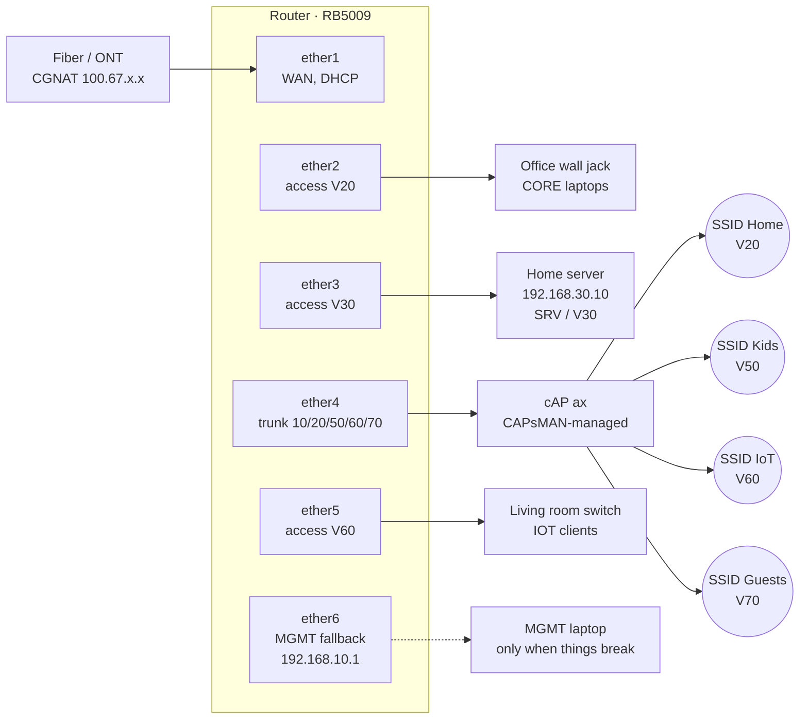

New house, structured cabling already in the walls, and after months of waiting — the fiber was finally in. The technician handed me a dangling RJ45 and said "good luck." My consumer router had no idea what was coming.

This was supposed to be the easy part. I had a plan. I had a repo of scripts. I had three weekends of reading about VLANs.

<!--more-->

_This is Part 4 of my home server journey. [Part 1](../home-server-part1) covered the inspiration, [Part 2](../home-server-part2) the Docker spiral, [Part 3](../home-server-part3) backups and security. Part 5 will cover the split-DNS payoff that this post made possible._

## Why Bother

The setup from Part 3 worked. Cloudflare Tunnels handled external access, AdGuard ate ads, everything was on one flat `192.168.1.0/24` network and it was fine.

Until gigabit fiber landed and made it suddenly, obviously, not fine.

A flat network means every device sees every other device. The smart bulbs can ARP-scan the file server. The kid's tablet shares broadcast traffic with the database. None of it is exploitable in any dramatic way, but it's the kind of architectural shrug you stop being okay with once you've spent months building a server you actually care about.

I wanted three things:

1. Real segmentation — at least separate VLANs for trusted devices, IoT junk, and guests
2. A router that wouldn't die when I asked it to do something interesting
3. Wi-Fi that could carry tagged VLANs to clients

Translation: replace the consumer router with something grown-up, run a couple of cables, configure VLAN-aware switching, and put up a managed access point.

Easy.

## The Shopping List

Hardware ended up minimal:

- **MikroTik RB5009UG+S+** — main router. ARM64, 8 gigabit ports, SFP+ cage I'm not using yet. Overkill for a home, exactly the right amount for a home lab. The non-PoE variant, which I'm regretting; more on that in a moment.
- **MikroTik cAP ax** — ceiling-mount AP, Wi-Fi 6, two ethernet ports, PoE-powered.
- **TP-Link SG105E** — small managed switch for the living room corner where there are three wired devices and one wall jack.

About that PoE thing. The RB5009 comes in two variants: with and without PoE-out. I cheaped out and got the non-PoE one. The logic at the time was "I only need to power one device, the injector is included with the cAP ax, the PoE router is €80 more, do the math." The math was wrong. The cabinet has no spare power outlets and no room for a power strip, so the injector ended up mounted next to the RJ45 wall socket on the other side of the room — a visible, ugly little black brick. The €80 would have bought me a tidy cabinet and the option to add another PoE device later without thinking. Future me, learn from this me.



The fiber media converter feeds straight into the router's `ether1`. Everything else is copper.

## The VLAN Plan

I overthought this for about a week and then committed:

| VLAN | Name  | Subnet            | Purpose                                  |
| ---- | ----- | ----------------- | ---------------------------------------- |
| 10   | MGMT  | `192.168.10.0/24` | Router/AP/switch admin only              |
| 20   | CORE  | `192.168.20.0/24` | Trusted laptops, phones, family devices  |
| 30   | SRV   | `192.168.30.0/24` | The home server lives here, alone        |
| 50   | KIDS  | `192.168.50.0/24` | Kids' devices once they have any         |
| 60   | IOT   | `192.168.60.0/24` | Smart home crap, TV, vacuum, light bulbs |
| 70   | GUEST | `192.168.70.0/24` | Self-explanatory                         |

Forwarding policy is roughly:

- MGMT can reach everything (admin path)
- CORE can reach SRV (laptops talking to Nextcloud)
- SRV can reach the internet
- KIDS / IOT / GUEST get internet only, no LAN access

Plus DNS redirects so CORE/KIDS/IOT can't bypass AdGuard by hardcoding `8.8.8.8`. (Spoiler: this is exactly the rule that bites me at the end of this post.)

## The Port Map

Print this, stick it on the cabinet, save your future self:

| Port  | Role                  | Notes                                    |
| ----- | --------------------- | ---------------------------------------- |
| ether1 | WAN                  | Fiber media converter                    |
| ether2 | CORE access (V20)    | Office wall jack                         |
| ether3 | SRV access (V30)     | Server wall jack                         |
| ether4 | AP trunk             | Tagged 10/20/50/60/70 to cAP ax          |
| ether5 | IOT access (V60)     | Living room dumb switch uplink           |
| ether6 | **MGMT fallback**    | Always-on admin port. The hero of this post. |





<div style="text-align: center;">
    
</div>


## The Repeatable Setup Dream

I'm a developer, and developers have a particular illness: when faced with a manual procedure, we cannot just do it. We must first turn it into code, ideally idempotent code, with a runner script and a `secrets.env` and a dry-run mode.

So I created a repo of RouterOS scripts — fifteen ordered files, `01-password.rsc` through `15-firewall-input-lockdown.rsc`, rendered through Go templates, applied over SSH by an `apply-all.sh` runner with `--from`, `--until`, `--resume`, and `--dry-run` flags.

It was beautiful. It was going to be plug-and-play.

It was not plug-and-play.

## What Actually Happened, In Order

### Steps 01-04: success

Password set. WAN DHCP came up immediately and got a CGNAT-y `100.67.x.x` address. Default route appeared, internet worked. Clock synced. Looked great.

### Step 03: a cleanup quirk and an actual bug

Two things went wrong here, and I noticed exactly one of them at the time.

The runner left this trailing on every successful step:

```
Script file loaded and executed successfully
expected end of command (line 1 column 16)
```

That second line is a bug in the cleanup phase of `apply-all.sh` — the step itself succeeded, but a stray command afterward parsed wrong. Cosmetic. Ignored.

The actual bug, the one that mattered: the firewall rule for allowing DHCP from non-WAN interfaces had this gem:

```routeros
/ip firewall filter add chain=input in-interface=!$wanIface protocol=udp dst-port=67 action=accept
```

That `!$wanIface` does not mean what shell-brain wants it to mean in a RouterOS import context. The honest version of how this got into the script: I let an LLM draft the firewall step and I didn't push hard enough on the syntax before applying. The dry-run pass through the templates rendered cleanly, the linter was happy, the script said "Step 03 complete" — and the actual import on real hardware partially applied and moved on without telling me which line had failed. "It compiled, it must work" energy.

Subtle, but contained. The internet still worked. Lesson very firmly logged: dry-run rendering is not the same as a dry-run apply, and I should have tested every script against a sacrificial RouterOS VM before pointing it at hardware that had to keep functioning.

### Step 05: the lockout

Step 05 is the bridge + VLAN-filtering migration. This is the dangerous one. You take all your physical ports, slave them to a bridge, declare a VLAN table, then flip `vlan-filtering=yes` and pray.

The repo's script does this in one big import. Halfway through, RouterOS rejected a `bridge vlan add` line because of how the variables expanded into the tagged interface list. Some commands had already executed:

- bridge created
- `ether6` (my management port!) added to the bridge as a slave
- VLAN table half-built
- `vlan-filtering=yes` not yet applied

The mgmt IP `192.168.10.1/24` was still nominally on `ether6`, but `ether6` was now a bridge slave with no proper VLAN plumbing yet. SSH session dropped.

Tried to reconnect: "no route to host."

Tried WinBox over IP: timeout.

Tried WinBox MAC connect: thirty seconds of `MACCON,WARN synTimeout iface: 0 resend: 0` followed by 1 through 9, then `Could not connect, MacConnection syn timeout`.

This is the moment in every networking project where you discover whether you have a serial cable. I did not have a serial cable.

### The "luckily I'd labeled this drop" recovery

Here's where the MGMT fallback labeling paid for itself.

Hard reset on the RB5009 — hold the button while powering on, release after 5-10 seconds for default-config reset (not the longer hold for netinstall mode). Wait two minutes. Plug laptop into `ether6` directly. Force a static `192.168.10.2/24` on the laptop NIC because Pop!_OS was still autoconnecting Wi-Fi and getting confused about routes:

```bash
nmcli connection modify "Wired connection 1" \
  ipv4.method manual \
  ipv4.addresses 192.168.10.2/24 \
  ipv4.gateway "" \
  ipv4.never-default yes \
  ipv6.method ignore
nmcli connection down "Wired connection 1"
nmcli connection up "Wired connection 1"
```

`ipv4.never-default yes` is the key bit — keeps Wi-Fi as the default route so I still have internet to look up commands.

Reset _looked_ unsuccessful at first (couldn't reach `192.168.88.1`), but WinBox MAC connect worked once the bridge was gone. Got back in. Took a deep breath.

### Plan B: do it manually like a normal person

I closed the apply-all script and never opened it again that night.

The migration order that actually worked, which I now believe is the only correct order for VLAN-aware bridges on RouterOS, is:

1. Build the bridge with `vlan-filtering=no`. Add ports. Set PVIDs. _Don't enable filtering yet._
2. Create the VLAN interfaces on the bridge (`vlan-mgmt`, `vlan-core`, etc.).
3. Assign gateway IPs to the VLAN interfaces.
4. **Verify each VLAN works** before turning on filtering. Plug a laptop into `ether2`, see if you get `192.168.20.x`. If not, fix it now.
5. Only then `vlan-filtering=yes`.

But — and this is the trick — keep one port out of all that. `ether6` stays as a plain access port with `192.168.10.1/24` directly assigned. No VLAN, no bridge slavery, no clever tagging. If anything goes sideways, you plug a laptop into `ether6` and you're in.

Mine has been like that ever since. It is mildly architecturally ugly. It has saved me three more times. I will not be removing it.

### Step 7-13: services, mostly uneventful

DHCP servers per VLAN, NAT masquerade on `ether1`, forward rules, DNS pointed at the home server, NTP. Each one I applied as a small block, verified with `print` between every meaningful change.

DHCP gives clients on most VLANs `192.168.30.10` as DNS — that's the server's intended address, where AdGuard listens.

Which brings us to:

### The server doesn't want to be `.10`

I plugged the home server into `ether3` (SRV). It got an IP. The wrong IP.

```
[admin@MikroTik] > /ip dhcp-server lease print where server=dhcp-srv
0 D 192.168.30.254  D4:5D:64:D6:45:79  home  bound
2   192.168.30.10   D4:5D:64:D6:45:79         waiting
```

The static lease for `.10` was sitting there, waiting forever, because the server already had a dynamic `.254` lease and Linux DHCP wasn't bothered enough to switch. Meanwhile DHCP was telling every other client "your DNS server is `192.168.30.10`" — which nothing was answering at, because the actual server was at `.254`.

So the entire LAN had a beautifully configured DNS resolver pointing at empty space, and nothing could resolve `google.com`.

The fix was three commands and one server reboot:

```routeros
/ip dhcp-server lease remove [find where mac-address="D4:5D:64:D6:45:79"]
/ip dhcp-server lease add server=dhcp-srv \
  mac-address=D4:5D:64:D6:90:78 \
  address=192.168.30.10 \
  comment="homeserver"
```

Reboot the server, watch the lease bind to `.10`, watch ARP go from `failed` to `reachable`, and suddenly the entire network has DNS again. AdGuard shows up. Browsers work. The dashboard fills with green checks.

That moment of "oh, _that's_ why nothing has been working" is genuinely the best feeling in self-hosting.

## The AP Saga (or: I Should Have Updated First, You Idiot)

The cAP ax sat in a box during all of the above. I plugged it in once everything else was stable.

The plan was reasonable: power up the AP, it boots into default config, I bootstrap it with a CAP-mode script, plug it into `ether4`, and CAPsMAN on the router adopts it.

The plan went sideways.

### Round 1: WinBox couldn't see the AP

Direct cable from laptop to AP. AP's default Wi-Fi SSID was visible. AP IP `192.168.88.1` was unreachable. WinBox neighbors empty. I reset the AP, twice. Same.

I eventually cracked it open by connecting to its default SSID with the WiFi key from the sticker (note: MikroTik prints _two_ different secrets on the sticker — "password" is the admin login, "WiFi key" is the SSID password, and they are not the same), then logging in with WinBox over Wi-Fi. The default-config setup wizard appeared.

I read the prompt. I had the option to "Remove configuration" or accept it.

I clicked Remove configuration.

Reader, you should never click Remove configuration on a wireless device while you are currently connected to it via the wireless interface that is about to disappear.

The AP went dark. Hard reset again.

### Round 2: bridge, VLAN, and the wrong port

After the reset I bootstrapped the AP for CAP mode. Add a VLAN-mgmt interface. Static IP on it. Tell the AP where the controller lives. Tag the uplink port for VLANs 10/20/50/60/70.

Plugged AP into router `ether4`. Checked CAPsMAN:

```
[admin@MikroTik] > /interface wifi capsman remote-cap print
```

Empty.

Long debugging session here, but the relevant bug: I had set the AP to tag VLAN 10 on `ether1`, but `ether1` _wasn't in the AP's bridge_. Default config left it as a separate WAN-style port. The VLAN trunk was being tagged onto a port that wasn't even in the switching path.

```routeros
/interface bridge port add bridge=bridge interface=ether1 \
  frame-types=admit-only-vlan-tagged
```

That fixed L2. Then I noticed the router's `ether4` had been left in access mode (`pvid=10`, `frame-types=admit-all`) from a previous panic-debugging session, when I was trying to onboard the AP without tags. Reverted to a real trunk:

```routeros
/interface bridge port set [find where interface="ether4"] \
  pvid=1 frame-types=admit-only-vlan-tagged
/interface bridge vlan set [find where vlan-ids=10] \
  tagged=bridge,ether4 untagged=""
```

Two seconds later:

```
0 04:F4:1C:C8:53:7A%vlan-mgmt  MikroTik  Ok  cAPGi-5HaxD2HaxD  7.19.6
```

CAP joined. Provisioning rules applied. The right SSIDs (`Home`, `Kids`, `IoT`, `Guests`) appeared on the air.

### Round 3: clients connect, no internet

Phones could see `Home`. Could connect. Got assigned to the Wi-Fi. Got... no DHCP lease. Disconnected.

`registration-table` showed the client with `wpa2-psk Authorized`. The auth half worked. The data half didn't.

I tried every datapath setting RouterOS would accept:

```
expected end of command (line 1 column 58)
expected end of command (line 1 column 72)
value of datapath.vlan-id out of range (1..4095)
```

Half the fields didn't exist. The `traffic-processing=on-capsman` option I'd been reading about? Introduced in 7.19. I was on 7.18.2.

You can probably guess the punchline.

I updated the router. I updated the AP. The AP had to be factory-reset to upgrade because the upgrade path in 7.18 didn't recognize new package signing. Bootstrapped it from scratch _again_. Plugged it back in.

Everything worked instantly. Clients got DHCP leases. Internet worked. SSIDs were stable.

The moral here is short: **before you spend four hours debugging RouterOS feature behavior, run `/system package update check-for-updates`.** I wish I had a more sophisticated lesson, but no, that's it. I am the cautionary tale.

## The Forward Rule That Cost Me Another Hour

Connected to `Home` on Wi-Fi: full internet. Connected to `Kids`: nothing. `IoT`: nothing. `Guests`: works fine.

This had a clean signature. Guests works because guest VLAN's DHCP gives `1.1.1.1` as DNS. Everything else points at AdGuard at `192.168.30.10`. So Kids and IoT could reach `1.1.1.1` directly (`ping` worked), but couldn't resolve hostnames.

The forward rules:

```routeros
/ip firewall filter add chain=forward src-address=192.168.50.0/24 \
  dst-address=192.168.0.0/16 action=drop comment="KIDS block LAN"
/ip firewall filter add chain=forward src-address=192.168.60.0/24 \
  dst-address=192.168.0.0/16 action=drop comment="IOT block LAN"
```

Block all LAN access from kids/iot. Including, it turns out, access to the AdGuard server on the SRV VLAN. Including, by extension, DNS.

The fix is exception rules placed _above_ the block rules:

```routeros
/ip firewall filter add chain=forward \
  src-address=192.168.50.0/24 dst-address=192.168.30.10 \
  protocol=udp dst-port=53 action=accept \
  comment="KIDS DNS -> AdGuard UDP"
# (and TCP variant, and IOT variants)
/ip firewall filter move \
  [find where comment="KIDS DNS -> AdGuard UDP"] \
  [find where comment="KIDS block LAN"]
```

Forward chain only — never input chain — so worst case is some clients can't browse, mgmt access is fine. I did this in Safe Mode anyway, because I have learned my lesson, sort of, somewhat.

## What's Actually Running Now



DHCP servers per VLAN. NAT masquerade on `ether1`. DNS forced to `192.168.30.10` (AdGuard) for trusted VLANs, `1.1.1.1` for guests.

CAPsMAN-managed AP means I configure SSIDs once on the router and the AP just does what it's told. If I add a second AP later, it auto-provisions.

The home server has a stable, predictable LAN IP. Which finally lets me solve the problem from the intro to Part 5: stop bouncing my own LAN traffic through Cloudflare's edge in Frankfurt.

## Things I Did Right (Eventually)

- **One emergency port, untouchable.** `ether6` with a plain mgmt IP. No VLAN, no fanciness. When everything else breaks, that port is your way back in. Label it. Document the recovery procedure on the cabinet itself.
- **Manual chunks > big-bang scripts**, at least the first time through. The repo I wrote is genuinely useful as documentation and for re-applying known-good config to a fresh router. It is _not_ useful as a "just run this" tool on hardware you can't easily reach, because partial failures are devastating.
- **VLAN-filtering goes on _last_.** Build everything with filtering off, verify every interface, _then_ flip the switch.
- **Update before debugging.** I'm pretending this lesson is somehow novel.
- **Safe Mode is a real thing.** `Ctrl+X` in a RouterOS terminal puts the session in Safe Mode. If the connection drops, all uncommitted changes revert. I should have been using it from the start.

## Things I Did Wrong

- **Trusted my own scripts on un-tested hardware**, and discovered every parsing edge case the way you'd expect.
- **Clicked "Remove configuration" while connected over Wi-Fi.** In my defense it was late, the dialog was ambiguous, and "remove" sounded like the action that gets you to a clean slate. In reality "remove" gets you to a clean slate via the door marked "no more network for you." Lesson: read the dialog, then read it again, then go make tea, then read it a third time.
- **Ran a `Wired connection 1` profile against six different subnets in one evening** and got increasingly confused about why nothing pinged. It was always my own laptop.
- **Did not update the AP first.** Discussed at length above.

## What's Next

The whole reason this matters is in Part 5. Now that the server has a stable local IP, AdGuard is running as the authoritative DNS for the trusted VLANs, and the network is no longer a flat soup, I can do the thing that gigabit fiber actually unlocks: stop sending LAN traffic to the internet and back.

That post is mostly written. It involves Caddy, custom Docker builds, Cloudflare API tokens, and the deeply satisfying realization that I'd been adding 30ms of round-trip latency to every single Immich thumbnail for months.

For now, the network is a network. The lights are green. The cabinet looks tidy. The KIDS VLAN is empty because my kids are still young enough that "screen time" means handing them my phone — but it's sitting there ready, with its own DHCP pool and forward rules already locking it down to internet-only. Future-proofing as parental control by way of network engineering. Files under "things you can only get away with if you're already this deep in the weeds."

`ether6` is still labeled "EMERGENCY ROUTER ACCESS." It's not going anywhere.

**Coming soon: Part 5 - The Network Finally Catches Up**
