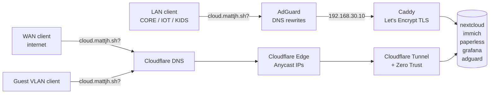

Nextcloud uploads were fine. Just fine. The kind of fine that makes you suspicious.

I'd just gotten gigabit fiber installed, and instead of everything feeling faster, the stack felt the same as it had on the old 5G router line. Browsing the photo library still had a half-beat of lag. Opening Paperless still felt like a coffee opportunity. Either I'd wasted money on the upgrade or something about my architecture was wasting the bandwidth on my behalf.

Spoiler: option two.

<!--more-->

_This is Part 5 of my home server journey. [Part 1](../home-server-part1) covered the inspiration, [Part 2](../home-server-part2) the Docker spiral, [Part 3](../home-server-part3) backups and security, [Part 4](../home-server-part4) the physical network rebuild that this post completely depends on._

## The Architecture Problem I'd Been Ignoring

The setup from Part 3 was secure and functional. Cloudflare Tunnels handled all external access, Zero Trust policies kept things locked down. Everything went through Cloudflare. _Always_, including when I was sitting two meters from the server.

```
Me (on LAN) → router → Cloudflare edge (Frankfurt-ish) → back home → server
```

That's a round trip of 30-50ms for every API call, every file chunk, every thumbnail load. At 100 Mbit/s the overhead was invisible — bandwidth was always the constraint. At 1 Gbit/s, that overhead became the bottleneck. Immich loading hundreds of thumbnails meant hundreds of round trips across cloudflares edge network for a feature that's supposed to feel instant.

The fix has a name: **split DNS**. When you're on the local network, resolve `cloud.mattjh.sh` to the server's local IP instead of Cloudflare's. Traffic stays on the LAN. Cloudflare stays in the picture for everyone else.

Simple concept, two prerequisites I didn't have a year ago: a server with a known LAN IP, and DNS I actually controlled. [Part 4](../home-server-part4) fixed both. This post uses them.

## What Part 4 Left Me With

The boring summary, since most of the heavy lifting is in the previous post:

- Six VLANs (MGMT, CORE, SRV, KIDS, IOT, GUEST), each with its own subnet and gateway.
- The home server on SRV at a static `192.168.30.10`, courtesy of a DHCP reservation that took two reboots and a small spiritual crisis to land properly.
- AdGuard Home running on the server, advertised as the authoritative DNS for the trusted VLANs (CORE, KIDS, IOT) via DHCP.
- Guest VLAN (V70) intentionally points at `1.1.1.1` instead of AdGuard. This was originally just for guest privacy, but turned out to be useful in a way I didn't predict — see below.

That's the foundation. Everything in this post sits on top of it.

## AdGuard as the Split-DNS Brain

AdGuard was already in my stack as a network-wide ad blocker. What I hadn't used was its **DNS rewrite** feature — intercept queries for specific domains and return whatever answer you want.

In the AdGuard dashboard under **DNS rewrites**, I added entries for all my subdomains:

```
cloud.mattjh.sh        → 192.168.30.10
photos.mattjh.sh       → 192.168.30.10
paperless.mattjh.sh    → 192.168.30.10
grafana.mattjh.sh      → 192.168.30.10
adguard.mattjh.sh      → 192.168.30.10
```

Or directly in `/srv/docker/adguard/conf/AdGuardHome.yaml`:

```yaml
rewrites:
  - domain: cloud.mattjh.sh
    answer: 192.168.30.10
  - domain: photos.mattjh.sh
    answer: 192.168.30.10
  # etc.
```

Now any device using AdGuard for DNS — everything on the trusted VLANs — resolves my subdomains to the local IP. The request never leaves the house.

Quick sanity check from the LAN:

```bash
nslookup cloud.mattjh.sh
# 192.168.30.10
```

From the guest VLAN with `1.1.1.1` as DNS, you get Cloudflare's IPs back. That's the split working as designed.

## The TLS Problem

Once you bypass Cloudflare, you lose their TLS termination. Hit `https://cloud.mattjh.sh` locally and your browser is talking directly to a server with no certificate.

The solution is **DNS-01 challenge** certificates from Let's Encrypt. The DNS challenge works for internal servers because it proves domain ownership by temporarily adding a TXT record to your public DNS zone — no need for the CA to reach your server directly.

Caddy handles this almost embarrassingly well with the Cloudflare DNS plugin.

## Caddy: The New LAN Ingress

I'd been running a host-level nginx for a while, doing basically nothing useful. Caddy replaces it properly.

### The Custom Build

The Cloudflare DNS plugin isn't in the standard Caddy image — needs to be compiled in. Worth being precise with the Dockerfile because a subtle mistake here (an extra `*` on a `COPY` destination, for instance) will result in the plugin appearing to build successfully but not actually being present at runtime. Ask me how I know.

**`caddy/Dockerfile`:**

```dockerfile
FROM caddy:2.11.2-builder AS builder
RUN xcaddy build \
    --with github.com/caddy-dns/cloudflare

FROM caddy:2.11.2
COPY --from=builder /usr/bin/caddy /usr/bin/caddy
```

### The Caddyfile

```caddyfile
{
    email me@mattjh.sh
    # Uncomment during initial setup to avoid rate limits:
    # acme_ca https://acme-staging-v02.api.letsencrypt.org/directory
}

(cloudflare_tls) {
    tls {
        dns cloudflare {env.CF_API_TOKEN}
    }
}

cloud.mattjh.sh {
    import cloudflare_tls
    reverse_proxy nextcloud:80
}

photos.mattjh.sh {
    import cloudflare_tls
    reverse_proxy immich-server:2283
}

paperless.mattjh.sh {
    import cloudflare_tls
    reverse_proxy paperless-ngx:8000
}

grafana.mattjh.sh {
    import cloudflare_tls
    reverse_proxy grafana:3000
}

adguard.mattjh.sh {
    import cloudflare_tls
    reverse_proxy adguard:80
}
```

The `(cloudflare_tls)` snippet is reusable — DNS challenge with the Cloudflare API. Import once per site, done. Caddy talks to other containers by name over the Docker network. No host port bindings, no IP addresses to keep track of.

### Cloudflare API Token

In Cloudflare: **My Profile → API Tokens → Create Token → Edit zone DNS template**, scoped to `mattjh.sh` only. Don't lock it to a specific source IP — dynamic IPs will break automatic cert renewal.

Add to `.env`:

```env
CF_API_TOKEN=your_token_here
```

### The compose addition

```yaml
caddy:
  build:
    context: ./caddy
    dockerfile: Dockerfile
  container_name: caddy
  restart: unless-stopped
  ports:
    - "80:80"
    - "443:443"
    - "443:443/udp"
  volumes:
    - ./caddy/Caddyfile:/etc/caddy/Caddyfile:ro
    - /srv/docker/caddy/data:/data
    - /srv/docker/caddy/config:/config
  environment:
    - CF_API_TOKEN=${CF_API_TOKEN}
  networks: [homelab]
```

## The Changes Ripple Out

Adding Caddy meant updating a few other things.

**Port 443 conflict.** AdGuard had `443:443/tcp` mapped for DNS-over-HTTPS. Caddy needs that port. Removed it from AdGuard — DNS-over-TLS on port 853 is the better option for LAN use anyway, and DoH on 443 was always a bit awkward.

**Pinned Docker network.** Without a fixed subnet, trusted-proxy CIDRs are guesswork. Explicit network definition:

```yaml
networks:
  homelab:
    driver: bridge
    ipam:
      config:
        - subnet: 172.18.0.0/16
```

Every service gets `networks: [homelab]` — except Tailscale, which uses `network_mode: host` and can't also be in a Docker network.

**Nextcloud proxy config.** Nextcloud needs to know Caddy is a legitimate proxy:

```php
<?php
$CONFIG = [
  'trusted_proxies'       => ['172.18.0.0/16'],
  'forwarded_for_headers' => ['HTTP_X_FORWARDED_FOR'],
  'overwriteprotocol'     => 'https',
];
```

Mounted into the container:

```yaml
volumes:
  - ./nextcloud-proxy.config.php:/var/www/html/config/proxy.config.php:ro
```

**Paperless** wants the equivalent in env vars:

```yaml
environment:
  PAPERLESS_TRUSTED_PROXIES: "172.18.0.0/16"
  PAPERLESS_USE_X_FORWARD_HOST: "true"
  PAPERLESS_USE_X_FORWARD_PORT: "true"
```

Grafana and Immich handle proxy headers correctly once `root_url` and the docker network are in place — no extra config needed.

**Port cleanup.** Services Caddy now fronts don't need host port bindings. They're reachable internally by container name. The `127.0.0.1:8080:80` style bindings on Nextcloud, Immich, Paperless, and Grafana all came out. Monitoring stack keeps its bindings since it's not behind Caddy.

## Deployment Gotchas

A few things that caught me during rollout:

**Docker daemon DNS.** When I ran `docker compose down`, AdGuard went with it, taking local DNS with it. The Docker daemon couldn't resolve `registry-1.docker.io`. Fix: set DNS on the host via NetworkManager so there's always a fallback:

```bash
sudo nmcli connection modify "Wired connection 1" \
  ipv4.dns "192.168.30.10 1.1.1.1"
sudo nmcli connection up "Wired connection 1"
```

The better long-term fix is at the router level so every device including the host picks it up automatically. (Part 6 ends up doing exactly that, for unrelated reasons.)

**Stage certs first.** Let's Encrypt has rate limits. Before switching to real certs, uncomment the staging CA line, bring Caddy up, wait for all domains to show `certificate obtained successfully`, then switch to production. Saves you from getting rate-limited while debugging.

**Old Docker networks.** A stale `nextcloud_default` was sitting on `172.18.0.0/16`, blocking the new network from creating. `docker network rm nextcloud_default` to clear.

## The Two-Path Architecture

After all this, here's what the traffic flow looks like:



Same domains, same backends, two different paths with different security postures. Both fully functional, both with valid TLS.

## Zero Trust Now Means Something Specific

Worth thinking through explicitly: Zero Trust protection only exists on the Cloudflare path. When you're on the LAN, Cloudflare is out of the picture entirely.

So for services like AdGuard and Grafana that I'd put behind Zero Trust authentication:

- **WAN** → Cloudflare Zero Trust gate → my GitHub passkey required
- **LAN** → Caddy → direct access, no gate

This is intentional. My LAN is trusted. Zero Trust was protecting the _internet-facing_ path, not the internal one. The mental model shifted from "Zero Trust protects this service" to "Cloudflare protects the WAN ingress, my LAN protects the LAN ingress." Two gates, same backends.

If someone gets onto my LAN, I have bigger problems than whether Grafana asks for a passkey. The VLAN segmentation from Part 4 is the actual defense at that point.

## The Accidental Test Environment

The guest VLAN using `1.1.1.1` turned out to be useful for reasons beyond guest privacy. Switching laptop networks is now an instant simulation of the external user experience — Cloudflare IPs, tunnel auth, Zero Trust policies, the whole thing.

No VPN, no phone hotspot, no extra setup. Flip Wi-Fi networks and you're an external user. Switch back and you're on the fast local path. It makes testing the WAN path trivial, which means I actually do it instead of assuming it works.

## SSH While We're At It

Same principle applies to SSH. It was going through `cloudflared access`, which adds latency from the proxy hop:

```
# ~/.ssh/config
Host home-local
    HostName 192.168.30.10
    User matth
    IdentityFile ~/.ssh/personal_git

Host home
    HostName ssh.mattjh.sh
    User matth
    ProxyCommand cloudflared access ssh --hostname ssh.mattjh.sh
    IdentityFile ~/.ssh/personal_git
```

`ssh home-local` when I'm on the LAN. `ssh home` when I'm out. Fast when home, accessible when not.

## What This Didn't Solve

Worth being honest about what's still rough:

- **DNS rewrites are manual.** Every new subdomain means two updates: the public Cloudflare DNS record _and_ the AdGuard rewrite. Forget one and you get either no LAN access or no WAN access for the new service.
- **Cert renewal depends on the Cloudflare API token.** Rotate it without updating Caddy's `.env` and renewals silently fail until certs expire. Calendar reminder set. We'll see if I listen to it.

Neither of these is dramatic. Both are the kind of thing that bites you six months later if you don't write them down.

## The Difference

The before-and-after is tangible. Immich loads thumbnails noticeably faster — not because the hardware changed, but because requests stopped making a Europe round trip. Nextcloud file operations feel snappy. The whole stack just feels like it's running on local hardware, which it is.

The Cloudflare tunnel was the right call when I set it up — it solved external access without port forwarding. But I'd never thought to also solve the _internal_ access path, so everything used the external one by default. Gigabit didn't make my setup faster. It just made the inefficiency obvious enough to fix.

## The Last Open Problem

There's a flaw running through everything above, and it gets worse the better the rest of the setup gets: **AdGuard is now critical infrastructure.** If that container falls over — a bad update, a `docker compose down` at the wrong moment, the server hanging on a kernel upgrade — every device on the trusted VLANs loses DNS. Internet stops. The household notices in roughly four seconds, and it's my fault.

The obvious mitigation is a fallback DNS server. The obvious place to run it is somewhere that isn't the server, because if the server is restarting, that's exactly when you need the fallback to be elsewhere.

A Raspberry Pi is the traditional answer. I don't love it. It's another always-on appliance with its own SD card, its own PSU, its own update cadence — a second box dressed up as a reliability improvement, with failure modes that aren't correlated with the thing it's backstopping.

The RB5009 has a different answer: it can run containers. That's where Part 6 picks up.

## What's Next

Part 6 walks through putting AdGuard on the router itself as a fallback resolver. It turns out to be smaller and weirder than the Caddy migration: an isolated `/30` to keep the routing table from getting clever, a one-line lesson about which directories AdGuard absolutely needs persisted, and a deeply satisfying `docker stop adguard` test that proves the household won't notice when the primary goes away.

**Coming soon: Part 6 - When the Router Runs the Fallback DNS**

_**Edit — 20th May 2026:** The manual DNS rewrite problem above didn't last long. Switched to a wildcard `*.mattjh.sh` rewrite in AdGuard — both the server instance and the router fallback — and a wildcard DNS record in Cloudflare. Adding a new service now only requires a Cloudflare Tunnel hostname and a Caddyfile block. DNS sorts itself._

---

_The setup keeps getting more interesting. Which is partly the point and partly a problem._

---
