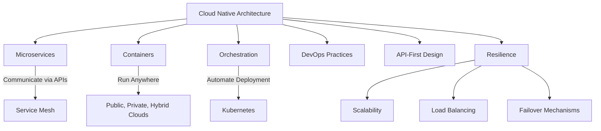
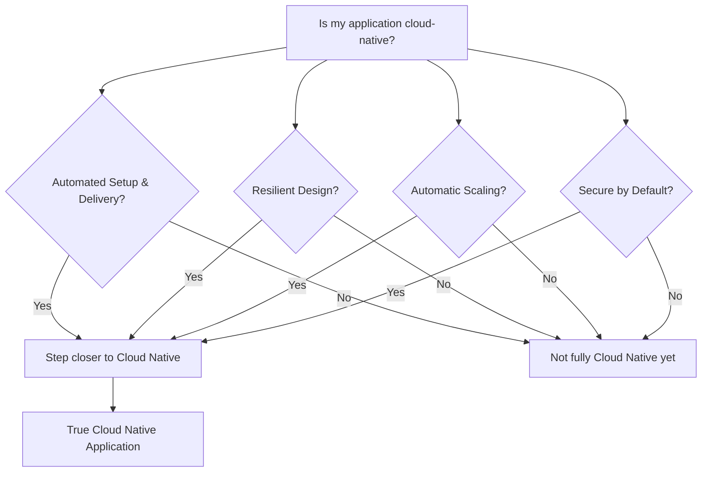
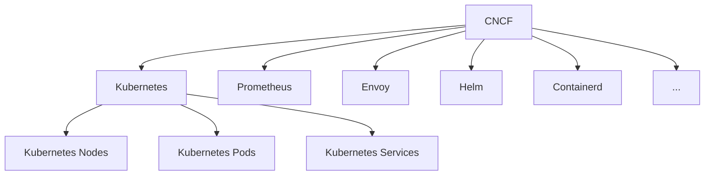

As I prepare for the **Kubernetes Cloud Native Associate (KCNA)** certification, I’ve decided to document my progress in a series of blog posts. This way, I can not only solidify my own understanding but also share insights with others who might be on a similar path.

<!--more-->

Today’s post will focus on **Cloud Native** concepts and the **Cloud Native Computing Foundation (CNCF)**, which form the foundation of KCNA preparation.


These notes are a polished version of my personal reflections taken while following along with [this Udemy course](https://www.udemy.com/course/dive-into-cloud-native-containers-kubernetes-and-the-kcna/?couponCode=LETSLEARNNOW). I found that taking meticulous notes while watching the content, combined with discussions with GPT about the topics, greatly enhances my understanding. Thus, some of this content is AI-generated.


---

## What is Cloud Native?

When we hear the term **cloud**, many of us immediately think of major public cloud providers like **AWS, Azure, or Google Cloud**. However, the "cloud" in **cloud native** isn’t limited to public clouds. It includes **private clouds**, **hybrid clouds**, and other infrastructure that supports cloud-native principles.

At its core, **Cloud Native** is about more than just where an application is hosted—it's about **how** applications are designed, deployed, and managed. The **Cloud Native** philosophy is built on two key pillars:

- **Cloud Native Architecture:** Applications are built and designed following best practices defined by the CNCF. This means they are designed to be _resilient, scalable, and manageable_ in dynamic cloud environments.
- **Cloud Native Culture:** Different roles, such as DevOps, SRE (Site Reliability Engineers), and FinOps, collaborate to drive changes in how applications are built and operated. This cultural shift promotes agility, automation, and continuous improvement.

### What Makes an Application Cloud Native?

For an application to be truly **cloud native**, it must meet specific principles and practices. It’s not enough to simply run the application in a cloud environment. Key questions to ask when determining if something is cloud native include:

- **Is the application automated in setup and delivery?**  
  Cloud native applications emphasize automation to streamline both the deployment and operational management of the app.
- **Has the application been designed with resilience in mind?**  
  Resilience ensures that the app can withstand failures and recover quickly without significant downtime.

- **Can the application scale automatically based on workload?**  
  Cloud native systems should be able to scale up or down automatically in response to changes in demand.

- **Is the application secure by default?**  
  Security should be baked into the design and deployment processes, with automated mechanisms for detecting and mitigating vulnerabilities.

### What Cloud Native is NOT

Many people assume they are practicing cloud native principles because their application is deployed in the cloud or uses containers, but this doesn’t automatically qualify it as cloud native. Here are a few misconceptions:

- **"My application is Cloud Native because it runs in the cloud."**  
  Running an application in the cloud is just a starting point. To be truly cloud native, the app needs to follow specific architectural principles, such as being _automated, resilient, and scalable._

- **"Cloud Native is all about containers."**  
  While containers are an essential part of the cloud native ecosystem, simply containerizing an app doesn't make it cloud native. Containers are a tool, but cloud native also involves orchestrating those containers (e.g., with Kubernetes), automating processes, and ensuring the application is fault-tolerant.

## Who is the Linux Foundation?

Before we dive deeper into the CNCF, it’s important to understand its parent organization, the **Linux Foundation**. The Linux Foundation was established in **2000** through a merger between the **Open Source Development Labs** and the **Free Standards Group**. Its goal was to **standardize Linux**, promote its growth, and support its commercial adoption.

The Linux Foundation became the **de facto standard** for Linux operating systems and has been a pivotal force in the open-source community. With backing from industry giants and key figures like **Linus Torvalds** (creator of Linux) and **Greg Kroah-Hartman** (Linux kernel maintainer), it has continued to support many open-source initiatives, including the CNCF.

## What is the CNCF (Cloud Native Computing Foundation)?

The **Cloud Native Computing Foundation (CNCF)** was born when Google **open-sourced the Kubernetes project** in **2014** and donated it to the CNCF. This move was pivotal in the development of cloud native technologies.

Today, the CNCF oversees **hundreds of projects** in the cloud-native space, including Kubernetes, Prometheus, Envoy, Helm, and more. The CNCF's mission is to make cloud-native computing ubiquitous by fostering and sustaining an ecosystem of open-source, vendor-neutral projects.

### Why the CNCF is Important:

- **Community-Driven:** The CNCF ensures that key projects, like Kubernetes, continue to evolve with the help of a broad community of developers and corporations.
- **Standardization:** The CNCF sets the standard for cloud-native technologies and best practices, guiding how companies should build and operate their cloud-native applications.

---

## Conclusion

In this first post of my KCNA preparation series, I’ve covered the foundational concepts of **Cloud Native** and **CNCF**. By understanding what makes an application truly cloud native, and what the CNCF does to support and standardize cloud-native technologies, we're setting ourselves up for success in mastering Kubernetes and its surrounding ecosystem.

Stay tuned for the next post, where I’ll dive deeper into **Kubernetes architecture** and some of the key cloud-native technologies that play a critical role in the KCNA exam. Let’s continue this journey together!
