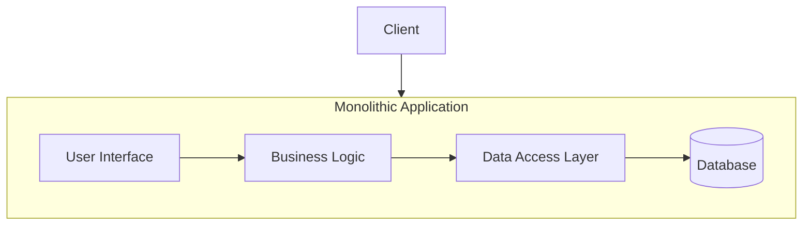
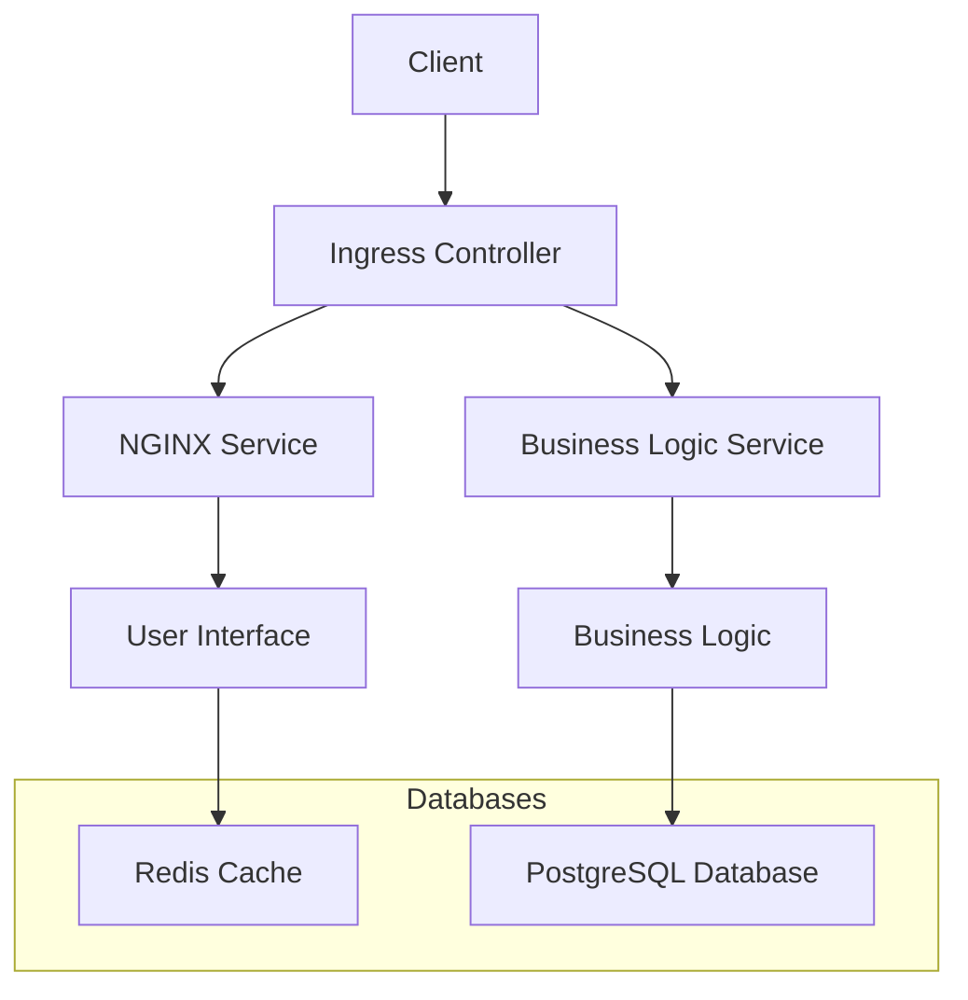
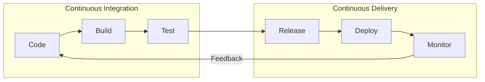
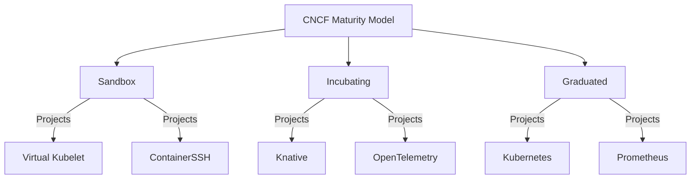

In this second part of this series we're diving into some fundamental aspects of **Cloud Native Applications** and **Kubernetes architecture**. By the end, you'll have a clearer understanding of how cloud-native principles, architectures, and practices differ from traditional approaches and how they enhance **R**esilience, **A**gility, **O**perability, and **O**bservability.

<!--more-->


These notes are a polished version of my personal reflections taken while following along with [this Udemy course](https://www.udemy.com/course/dive-into-cloud-native-containers-kubernetes-and-the-kcna/?couponCode=LETSLEARNNOW). I found that taking meticulous notes while watching the content, combined with discussions with GPT about the topics, greatly enhances my understanding. Thus, some of this content is AI-generated.


---

## Cloud Native Fundamentals

Cloud Native Applications harness the power of cloud infrastructure to enhance **resilience**, **agility**, **operability**, and **observability**. A memorable way to recall these key pillars is **Racoons Are Often Observant**:

- **R**esilience
- **A**gility
- **O**perability
- **O**bservability

These traits are foundational for building applications that thrive in dynamic environments like public, private, or hybrid clouds.

The CNCF plays a pivotal role in promoting cloud-native technologies. Its mission is to help organizations develop and run scalable, resilient applications in modern environments, such as cloud platforms, by leveraging key techniques such as:

- **Containers**
- **Service meshes**
- **Microservices**
- **Immutable infrastructure**
- **Declarative APIs**

These techniques work together to create **loosely coupled systems** that are **resilient**, **manageable**, and **observable**. With automation, they allow teams to deliver impactful changes with minimal downtime and reduced effort.

## Comparing Cloud Native with Monolithic Architecture

When comparing **monolithic architectures** to **cloud-native (microservices)**, the differences are striking. Let’s break it down:

### Monolithic Architecture:

In traditional monolithic architectures, components like the **user interface**, **business logic**, and **data interfaces** are tightly coupled, running on the same server and sharing the same system resources. This tight coupling often leads to:

- **Fragility**: Changes in one part can break others.
- **Dependency Conflicts**: Adding or updating one application can cause version conflicts, affecting the whole system.
- **Scalability Issues**: Scaling the system usually requires scaling the whole application, making it resource-intensive.

In essence, monolithic systems are harder to update and scale quickly.

### Microservices Architecture:

Cloud-native microservices decouple the components of the application into independent services, allowing each to scale and operate separately. For example, the **user interface** could be served by its own `NGINX` microservice, while the **business logic** might be powered by a separate `Java` service, with each component routing traffic through **Ingress Controllers**. This architecture provides:

- **Loose Coupling**: Easier to update or replace individual components without disrupting others.
- **Independent Scalability**: Each service can scale based on its specific demand, avoiding unnecessary resource consumption.
- **Improved Maintainability**: Teams can independently develop, test, and deploy services, fostering faster delivery.

## Cloud Native Practices

To fully embrace cloud-native architectures, there are several best practices to follow:

### 1. Microservices Architecture

This approach breaks down the application into **loosely coupled** components that can be independently deployed and managed. Each microservice focuses on a single responsibility, enhancing **agility** and **scalability**.

### 2. Containerization

By packaging applications and their dependencies into containers, developers ensure that these containers can run consistently across different environments. This approach enhances **isolation**, **efficiency**, and simplifies **management**.

### 3. DevOps

DevOps emphasizes collaboration between software development and IT operations teams, with a focus on **automation**, **monitoring**, and **collaboration**. This methodology speeds up the software development lifecycle and improves the quality of releases.

### 4. Continuous Delivery (CD)

CD is all about automating the build, test, and deployment processes, ensuring that code is always in a **releasable state**. This reduces the risk of introducing bugs and shortens the release cycle, enabling frequent, reliable updates.

## Kubernetes Self-Healing

One of the key cloud-native features Kubernetes offers is **self-healing**. Here’s how it works:

- **Deployments**: A declarative specification of the desired state of an application, defining how many replicas should run and how to handle updates.
- **ReplicaSet**: Managed by **deployments**, it ensures that the desired number of **Pods** are always up and running.
- **Pods**: The smallest deployable unit in Kubernetes, a Pod can contain one or more containers. Kubernetes ensures Pods stay running, restarting them if necessary.

## Application Automation

Automation is at the heart of cloud-native practices. Tools like **Ansible** and **Terraform** are commonly used:

- **Ansible**: Automates cloud-native environments by managing containers, deploying infrastructure, and configuring tasks.
- **Terraform**: Focuses on **Infrastructure as Code (IaC)**, enabling teams to deploy cloud infrastructure in a consistent, reproducible manner.

## CI/CD (Continuous Integration / Continuous Delivery)

CI/CD pipelines are critical to cloud-native applications. These pipelines automatically build, test, and deploy code, ensuring seamless integration and delivery. Here's a breakdown:

- **CI (Continuous Integration)**: This part of the pipeline runs automated tests, linting, and builds, ensuring code is ready for deployment once it passes.
- **CD (Continuous Delivery)**: Automatically prepares code for production, ensuring it’s always in a **releasable state**, even if not immediately deployed.
- **Continuous Deployment** is a more advanced practice that takes this further by automatically deploying every successful change to production. This is less common due to the operational complexities it introduces.

## Autoscaling in Kubernetes

Kubernetes offers several autoscaling options:

1. **Cluster Autoscaler**: Adjusts the size of a Kubernetes cluster based on pod resource needs.
2. **Horizontal Pod Autoscaler (HPA)**: Scales the number of pod replicas based on metrics like CPU or memory usage.
3. **Vertical Pod Autoscaler (VPA)**: Adjusts the CPU and memory requests/limits of individual pods.
4. **KEDA (Kubernetes Event Driven Autoscaling)**: Uses events and triggers to scale resources, including scaling to zero, which is excellent for cost savings.

There are also different scaling strategies:

- **Reactive Autoscaling**: Triggers based on metrics like CPU usage.
- **Scheduled Autoscaling**: Plans for predictable loads (e.g., end-of-month batch jobs).
- **Predictive Autoscaling**: Uses AI/ML to anticipate scaling needs.

## Community and Governance

The **Cloud Native Computing Foundation (CNCF)** is built around an open community that fosters collaboration and innovation in cloud-native technologies, with projects like Kubernetes, Envoy, and Prometheus. CNCF’s mission is to make cloud computing ubiquitous, and it does so by guiding projects through different maturity phases: **Sandbox**, **Incubating**, and **Graduated**. These stages reflect the project’s growth and adoption within the community.

- **Sandbox**: Early stage projects for experimentation.
- **Incubating**: More developed projects with growing adoption.
- **Graduated**: Mature projects with broad adoption, meeting rigorous requirements such as security, performance, and reliability.

A project’s transition from one phase to another is influenced by its adoption, security, functional maturity, and meeting user needs. The journey from incubating to graduated involves proving the project’s ability to serve pragmatic users and early adopters. The final stage sees it adopted by late majority users and laggards, marking broad success.

### CNCF Maturity Model

CNCF uses its maturity model to signal a project's reliability and sustainability to enterprises. Key factors include:

- Broad adoption across multiple organizations.
- A healthy rate of contributions and changes.
- Compliance with the CNCF Code of Conduct.
- Maintenance of the Core Infrastructure Initiative’s Best Practices Badge.

### Conflict Resolution and Voting

When there is a disagreement within the CNCF community, discussions and debates help refine proposals. If consensus cannot be reached, the CNCF uses elections and voting as a conflict resolution mechanism. This democratic process helps resolve differences and advance the community's goals.

## Serverless

Despite its name, **serverless** still involves servers, but the infrastructure management is handled by the cloud provider, shifting the responsibility away from users. Serverless architecture is event-driven, meaning that code is executed in response to events, and billing follows usage—potentially scaling up to meet demand or scaling down to zero when idle.



**Function as a Service (FaaS)**, such as **AWS Lambda**, is a typical example. In the cloud-native world, Kubernetes-based serverless solutions like **Knative** and **OpenFaaS** provide similar scalability and flexibility, automatically adjusting resources as needed.

### CloudEvents Specification

CNCF also hosts **CloudEvents**, which standardizes how event data is described and transferred across systems. It provides SDKs for various languages and specifications for protocols like HTTP, Kafka, and NATS.

## Personas

In any organization pursuing cloud-native practices, multiple professional roles contribute to building, operating, and scaling applications effectively. Each role plays a vital part in ensuring cloud-native principles, such as scalability, automation, resilience, and security, are integrated into the workflow.

### Key Roles in Cloud-Native Environments

Below are some of the key roles that shape cloud-native operations:

### 1. DevOps Engineer



A DevOps Engineer combines development and operations expertise to manage infrastructure and deploy software efficiently. Key skills include:

- **Infrastructure Provisioning**
- **Automation** (CI/CD, GitOps)
- **Performance Monitoring**
- **System Administration**

Their workflow follows the familiar DevOps infinity loop: planning → coding → building → testing → deploying → operating → monitoring.

### 2. Site Reliability Engineer (SRE)

Born from Google's need to manage reliability at scale, SREs focus on **availability, scalability, and robustness**. They are responsible for SLAs, SLOs, and SLIs, ensuring uptime and quick response times.

- **SLA**: Ensuring 99.99% uptime
- **SLO**: Keeping response times under 200ms
- **SLI**: Monitoring performance against objectives

### 3. CloudOps Engineer

CloudOps narrows its focus to cloud deployment, operation, and monitoring, especially for cloud-native environments. Tools like Terraform or direct cloud resource management differentiate CloudOps from traditional DevOps roles.

### 4. Security Engineer

Specializing in **IT security**, they address threats from various vectors, including:

- **Network Security**
- **Operating System Security**
- **Threat Detection and Mitigation**

### 5. DevSecOps Engineer

A blend of DevOps and security principles, DevSecOps Engineers integrate security best practices into the DevOps lifecycle. They automate vulnerability scanning, enforce security protocols, and ensure code and infrastructure security from development to deployment.

### 6. Full Stack Developer

Full-stack developers span both front-end and back-end development, working with **web frameworks**, **UI**, and backend **data handling** to build fully integrated systems.

### 7. Cloud Architect

Cloud Architects design cloud infrastructures and ensure they meet business needs. They decide on:

- **Cloud platforms** (AWS, GCP, etc.)
- **Multi-cloud strategies**
- **Cloud interoperability**

### 8. Data Engineer

Focused on scaling data pipelines, **data engineers** build systems that collect, store, and process data. They handle distributed data processing, algorithmic efficiency, and vendor-agnostic solutions to prevent lock-in.

## Open Standards

Adopting open standards is crucial in cloud-native architecture. Open standards promote interoperability and flexibility, enabling organizations to use best-of-breed tools without vendor lock-in.

### Examples of Open Standards:

- **OCI (Open Container Initiative)**: Ensures Docker images and runtimes are standardized, supporting compatibility across multiple platforms.

  - **Image Specification**: Defines how to bundle files into container images.
  - **Runtime Specification**: Standard for container runtimes (e.g., runC, kata Containers).
  - **Distribution Specification**: Standard for distributing container images.

- **CNI (Container Network Interface)**: Manages network resources in Kubernetes.
- **CSI (Container Storage Interface)**: Standardizes how storage is managed in containerized environments.

- **CRI (Container Runtime Interface)**: Interface for Kubernetes to interact with container runtimes.

- **SMI (Service Mesh Interface)**: A standard for service mesh management across different implementations (e.g., Istio, Linkerd).

## Cloud Native Terminology You Should Know

- **TOC (Technical Oversight Committee)**: Governs cloud-native project development.
- **SIG (Special Interest Groups)**: Focus groups within the CNCF community.
- **TAG (Technical Advisory Groups)**: Provide domain-specific guidance and help onboard new projects into the CNCF ecosystem.

## Conclusion

Cloud-native architecture is fundamentally transforming how modern applications are designed, deployed, and managed. By embracing key principles like **resilience**, **agility**, **operability**, and **observability**—or **RACO** for short—organizations can build systems that excel in today’s dynamic cloud environments. Techniques such as **microservices**, **containers**, **service meshes**, and **immutable infrastructure** empower teams to deliver software faster, scale more efficiently, and ensure higher uptime with minimal disruptions.

For cloud-native systems to function optimally, roles like **DevOps Engineers**, **Site Reliability Engineers (SREs)**, and **CloudOps Engineers** are critical. These professionals ensure seamless operation and scaling by leveraging tools like **CI/CD pipelines**, **self-healing mechanisms**, and **autoscaling**. By adopting **open standards**—such as **OCI**, **CNI**, and **SMI**—organizations avoid vendor lock-in and maintain flexibility in their infrastructure, fostering innovation across the ecosystem.

As the landscape of cloud-native technologies continues to evolve, practices like **continuous integration**, **continuous delivery**, and **predictive autoscaling** will only become more advanced. With the **CNCF** and its rich ecosystem driving forward the cloud-native movement, businesses can seize new opportunities for automation, scalability, and innovation. The cloud-native journey promises higher efficiency and resilience, helping organizations deliver modern, secure applications that meet today’s business and user demands.

This post is part two this **KCNA preparation series**. Stay tuned for the next installment, where we’ll dive deep into **Kubernetes fundamentals**!
