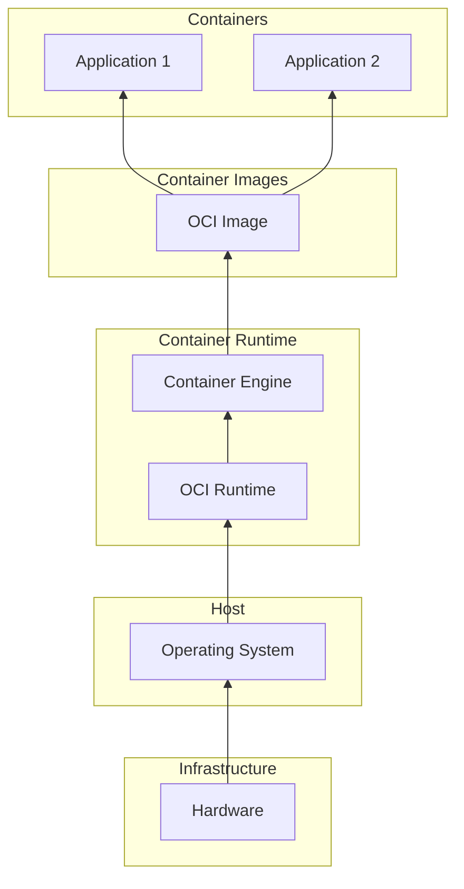

In this third part of the series, we’ll dive into the fundamentals of **Containers**, crucial to understanding the benefits that container orchestration via **Kubernetes** bring. You’ll gain insights into how containerization revolutionizes application deployment and management, while Kubernetes provides the orchestration needed for scalability and resilience. Lets explore the power of containers in modern application development.

<!--more-->


These notes are a polished version of my personal reflections taken while following along with [this Udemy course](https://www.udemy.com/course/dive-into-cloud-native-containers-kubernetes-and-the-kcna/?couponCode=LETSLEARNNOW) with the great instructor James Spurin. I found that taking meticulous notes while watching the content, combined with discussions with GPT about the topics, greatly enhances my understanding. Thus, some of this content is AI-generated.


---

## Introduction to Containers

Container technology has fundamentally transformed our approach to application development and architecture. Their ability to enable efficient management of applications at scale has become increasingly important.

### A Brief History of Container Technology

Understanding containers requires a look back at the evolution of virtualization and isolation technologies over the decades.

#### From Mainframes to Chroot

- **Mainframe Era**: The seeds of virtualization were planted in the 1960s and 1970s with mainframe systems like CP/CMS, which enabled time-sharing and virtual machines.
  - **CP/CMS**: This early operating system allowed multiple users to share the mainframe's resources.
  - **Time Sharing**: Enabled simultaneous access for multiple users, significantly enhancing resource utilization.
- **Chroot in Unix**: The introduction of `chroot` in Unix provided a way to change the root directory for a process, isolating it from the rest of the system's filesystem.
  - However, `chroot` had limitations, such as visibility of IP addresses and requiring root ownership of directories.

#### The Introduction of Jails and Virtual Machines

- **FreeBSD Jails**: In 2000, FreeBSD introduced Jails, which allowed for system partitioning into isolated environments with their own user sets, processes, and filesystems.
  - Jails represented a more advanced approach to isolation, but their complexity limited widespread adoption.
- **Virtual Machines**: Technologies like VMware and VirtualBox provided full virtualization by emulating physical machines.
  - Other systems, like Solaris Zones and HP-UX Virtual Partitions, contributed to the development of virtualized environments at the OS level, but these systems were also resource-intensive.

#### Modern Containerization with Namespaces and Cgroups

- **Namespaces**: Introduced to the Linux kernel in 2002, namespaces allowed isolation of system resources such as user IDs, processes, network interfaces, and file systems, forming the basis for containerization.
- **Cgroups**: Developed by Google, control groups (cgroups) enabled the management of system resources, such as CPU and memory, on a per-process basis.
  - Together, namespaces and cgroups formed the foundation for modern container technology, providing both isolation and resource control.

#### The Rise of Docker

- **Docker**: Docker emerged in 2013, combining namespaces and cgroups to create a user-friendly container platform. Its open-source launch popularized containerization by simplifying the deployment and management of applications across environments.
- **OCI Standards**: As container usage grew, the Open Container Initiative (OCI) established standards to ensure compatibility across container tools, extending Docker’s impact across the industry.

## Understanding Container Images

### What is a Container Image?

A container image is a portable, self-contained bundle of software and its dependencies, allowing consistent execution across computing environments. While "container image" and "Docker image" are often used interchangeably, **OCI-compliant container images** encompass a wider ecosystem, supporting multiple container technologies beyond Docker.

### Container Architecture Overview

Below is a high-level diagram of the core elements in a containerized environment:



### Differentiating Images and Containers

A **container image** is the blueprint for creating containers, while a **container** is the running instance of that image. For example, a single NGINX container image can be used to spawn multiple instances across various environments.

#### Running Multiple Containers with Shared Image Layers

1. **Create a `Dockerfile` with a Simple Web Server**

   ```dockerfile
   FROM python:3.11-alpine

   RUN pip install flask
   WORKDIR /app

   COPY app.py .
   CMD ["python", "app.py"]
   ```

2. **Create the Flask Application File**
   In the same directory, add `app.py`:

   ```python
   from flask import Flask
   app = Flask(__name__)

   @app.route("/")
   def hello():
     return "Hello from Flask!"

   if __name__ == "__main__":
     app.run(host="0.0.0.0", port=5000)
   ```

3. **Build the Image and Run Multiple Containers**

   ```bash
   docker build -t flask-app .
   docker run -d -p 5000:5000 flask-app
   docker run -d -p 5001:5000 flask-app
   ```

As you can see Docker reuses image layers, saving disk space and memory. Both containers run independently but share the same image layers, demonstrating efficient resource use.

### **Understanding and Using Tags**

Container image tags serve as version labels, making it easier to identify different builds of an image. Tags often represent versions, operating systems, or architectures, providing a way to distinguish between releases. However, the **`latest` tag**, despite its name, is not always the most recent—it’s simply the default if no other tag is specified.

#### **Tagging and Versioning Images in Practice**

Let’s explore tagging and versioning by creating and running multiple versions of a simple Flask application.

#### **Building and Tagging the First Version**

Build the container image, tagging it with `latest`:

```bash
docker build -t flask-app:latest .
```

Run the container:

```bash
docker run -d -p 5000:5000 flask-app:latest
```

#### **Creating and Tagging a New Version**

Now, let’s modify the Flask app to reflect a new version. Update `app.py`:

```python
# Change the return string to:
return "Hello from Flask - Version 2!"
```

Rebuild the image, tagging it as `v2` to indicate the new version:

```bash
docker build -t flask-app:v2 .
```

Run the updated version alongside the original:

```bash
docker run -d -p 5001:5000 flask-app:v2
```

At this point, both containers are running independently, demonstrating how tags allow multiple versions of the same image to coexist.

#### **Key Insights About Tags**

- **Explicit Tagging Prevents Confusion**: Always use explicit tags like `v1`, `v2`, or version-specific labels to ensure clarity. This avoids ambiguity compared to relying on the default `latest` tag.
- **`latest` Is Not Always Latest**: The `latest` tag points to the most recently tagged image without an explicit version. It’s a default convention, not a guarantee of the newest version.


In the example above, the first build was tagged as `latest` because no explicit tag was provided. Always be cautious when using `latest`, as it can lead to unexpected behavior in production environments.


## Working with Container Images

**Start Small**: Using a lightweight base image like `alpine` helps minimize the size of your images.

**Install Dependencies Only**: Keep the container image as lean as possible by installing only necessary dependencies. Document each step in your `Dockerfile` to ensure a repeatable and efficient build process.

### **Pulling Layers**

When you execute a command like `docker pull <image-name>:tag`, Docker downloads multiple **layers** to form the final image. Each layer represents a step in the image's build process, promoting efficiency by sharing layers across containers.

#### **Exploring Layers in a Container Image**

To understand how layers are structured, pull a standard image like `alpine` and inspect its history:

```bash
docker pull alpine:latest
docker history alpine:latest
```

- **Layers**: Each step in the image build process creates a layer. Layers improve storage efficiency as they can be reused across multiple images. The topmost layer is writable, allowing containers to make changes without affecting the underlying image.

- **Digest**: The digest is a unique SHA256 hash that ensures the integrity of an image. It verifies that the pulled image matches the original.

- **Image ID**: While similar to a digest, the Image ID identifies the image locally on your system and serves a slightly different purpose.

#### **Building a Multi-Layered Image**

Let’s create a simple `Dockerfile` to explore how layers are added. Save the following as `Dockerfile`:

```dockerfile
# Start with a base image
FROM alpine:latest

# Install a package, creating a new layer
RUN apk add --no-cache curl

# Add a file, creating another layer
RUN echo "Hello, world!" > /hello.txt
```

Build the image and inspect its layers:

```bash
docker build -t layered-example .
docker history layered-example
```

Each `RUN` command in the `Dockerfile` creates a new layer. While this modularity is useful for debugging, it can increase image size unnecessarily.

#### **Optimizing Layers for Efficiency**

To minimize the number of layers and reduce image size, combine commands in a single `RUN` statement:

```dockerfile
# Start with a base image
FROM alpine:latest

# Combine commands to reduce layers
RUN apk add --no-cache curl && echo "Hello, world!" > /hello.txt
```

Rebuild and inspect the optimized image:

```bash
docker build -t optimized-layered-example .
docker history optimized-layered-example
```

Notice how the optimized `Dockerfile` creates fewer layers, resulting in a smaller and more efficient image. By combining commands and avoiding unnecessary steps, you simplify your image and reduce overhead.

### Running Containers

Running a container is straightforward. Once you have an image, use `docker run <image-name>` to start it, and you can tailor its behavior with a variety of options. Each container instance operates independently, allowing flexibility in development and deployment.

#### **Basic Usage**

To start a container:

```bash
docker run <image-name>
```

For example, to run a containerized NGINX server:

```bash
docker run nginx
```

This command runs the container in the foreground, displaying its output. Use `Ctrl+C` to stop it.

#### **Running in Detached Mode**

To run the container in the background, add the `-d` flag:

```bash
docker run -d nginx
```

The container runs as a background process, and Docker returns the container ID.

#### **Interactive Mode**

For containers requiring user input, use the `-it` flags to enable interactive mode:

```bash
docker run -it ubuntu bash
```

This starts an interactive session within the container, allowing you to execute commands directly in its shell.

#### **Mounting Volumes**

To persist data or share files between the host and the container, use the `-v` flag:

```bash
docker run -v /path/on/host:/path/in/container nginx
```

For example, to serve custom HTML with NGINX:

```bash
docker run -d -v $(pwd)/my-site:/usr/share/nginx/html nginx
```

This maps the host’s `my-site` directory to the container's web root.

#### **Port Forwarding**

Expose container ports to the host with the `-p` flag:

```bash
docker run -d -p 8080:80 nginx
```

Here, port 8080 on the host forwards to port 80 in the container, making the web server accessible at `http://localhost:8080`.

#### **Automatic Cleanup**

To automatically remove a container after it stops, use the `--rm` flag:

```bash
docker run --rm ubuntu echo "Hello, world!"
```

This is useful for short-lived containers where you don't need to keep the state.

#### **Viewing Logs**

Use `docker logs` to view the output of a running or stopped container:

```bash
docker logs <container-id>
```

For live logs, add the `-f` flag:

```bash
docker logs -f <container-id>
```

#### **Listing and Stopping Containers**

To list running containers:

```bash
docker ps
```

For all containers, including stopped ones:

```bash
docker ps -a
```

Stop a running container with:

```bash
docker stop <container-id>
```

#### **Combining Options**

You can mix and match options for powerful one-liners. For instance, to run a temporary, interactive Python container with mounted files:

```bash
docker run --rm -it -v $(pwd):/app python:3.11 python /app/script.py
```

This command:

- Runs Python interactively (`-it`).
- Mounts the current directory into the container (`-v`).
- Automatically removes the container upon exit (`--rm`).

### Cleaning Up

An essential practice is managing disk space by removing unused containers and images. Here’s a quick cleanup guide:

1. **List and Remove Containers**

   ```bash
   # List all containers (including stopped ones)
   docker ps -a

   # Remove a specific container
   docker rm <container-id>

   # Remove all stopped containers
   docker container prune
   ```

2. **List and Remove Images**

   ```bash
   # List all images
   docker images

   # Remove a specific image
   docker rmi <image-id>

   # Remove unused images
   docker image prune
   ```

Regular cleanup helps keep the system efficient and avoids storage issues, an important practice in production environments.

## Key Takeaways for Container Optimization

1. **Aim for Small Containers**: Minimalism is key. Reducing the size of your images optimizes performance and speeds up deployment.
2. **Choose Base Images Thoughtfully**: Starting with a base image suited to your app's needs helps streamline the container.
3. **Refine Your `Dockerfile` Iteratively**: Experiment within a base image to determine essential dependencies, then lock these into a final `Dockerfile` for efficiency and reliability.
4. **Understand Layers**: Each `RUN`, `COPY`, or `ADD` command in a `Dockerfile` creates a new layer.
5. **Optimize Your Dockerfile**: Use lightweight base images, combine commands, and avoid unnecessary steps to create smaller, faster images.
6. **Inspect Regularly**: Tools like `docker history` help you analyze and refine your image layers.
