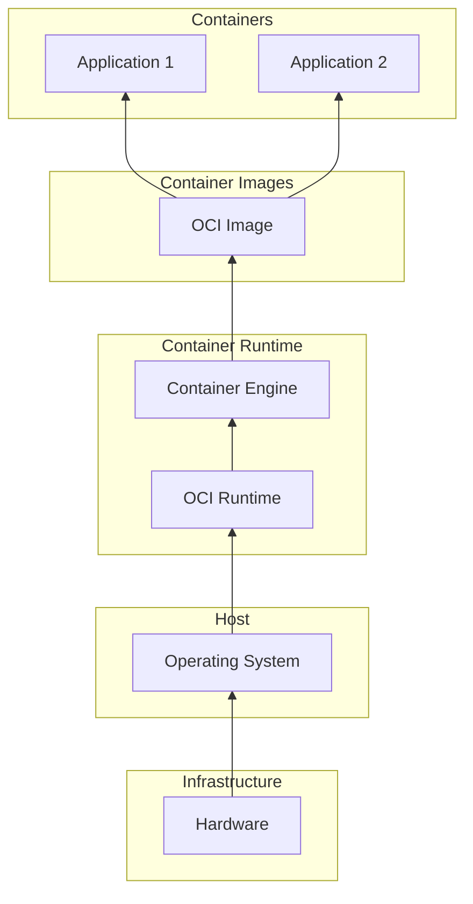

In this third part of the series, we’ll dive into the fundamentals of **Containers**, crucial to understanding the benefits that container orchestration via **Kubernetes** bring. You’ll gain insights into how containerization revolutionizes application deployment and management, while Kubernetes provides the orchestration needed for scalability and resilience. Lets explore the power of containers in modern application development.

<!--more-->


These notes are a polished version of my personal reflections taken while following along with [this Udemy course](https://www.udemy.com/course/dive-into-cloud-native-containers-kubernetes-and-the-kcna/?couponCode=LETSLEARNNOW). I found that taking meticulous notes while watching the content, combined with discussions with GPT about the topics, greatly enhances my understanding. Thus, some of this content is AI-generated.


---

## Introduction to Containers

Container technology has fundamentally transformed our approach to application development and architecture. Their ability to enable efficient management of applications at scale has become increasingly important.

## A Brief History of Container Technology

Understanding containers requires a look back at the evolution of virtualization and isolation technologies over the decades.

### From Mainframes to Chroot

- **Mainframe Era**: The seeds of virtualization were planted in the 1960s and 1970s with mainframe systems like CP/CMS, which enabled time-sharing and virtual machines.
  - **CP/CMS**: This early operating system allowed multiple users to share the mainframe's resources.
  - **Time Sharing**: Enabled simultaneous access for multiple users, significantly enhancing resource utilization.
- **Chroot in Unix**: The introduction of `chroot` in Unix provided a way to change the root directory for a process, isolating it from the rest of the system's filesystem.
  - However, `chroot` had limitations, such as visibility of IP addresses and requiring root ownership of directories.

### The Introduction of Jails and Virtual Machines

- **FreeBSD Jails**: In 2000, FreeBSD introduced Jails, which allowed for system partitioning into isolated environments with their own user sets, processes, and filesystems.
  - Jails represented a more advanced approach to isolation, but their complexity limited widespread adoption.
- **Virtual Machines**: Technologies like VMware and VirtualBox provided full virtualization by emulating physical machines.
  - Other systems, like Solaris Zones and HP-UX Virtual Partitions, contributed to the development of virtualized environments at the OS level, but these systems were also resource-intensive.

### Modern Containerization with Namespaces and Cgroups

- **Namespaces**: Introduced to the Linux kernel in 2002, namespaces allowed isolation of system resources such as user IDs, processes, network interfaces, and file systems, forming the basis for containerization.
- **Cgroups**: Developed by Google, control groups (cgroups) enabled the management of system resources, such as CPU and memory, on a per-process basis.
  - Together, namespaces and cgroups formed the foundation for modern container technology, providing both isolation and resource control.

### The Rise of Docker

- **Docker**: Docker emerged in 2013, combining namespaces and cgroups to create a user-friendly container platform. Its open-source launch popularized containerization by simplifying the deployment and management of applications across environments.
- **OCI Standards**: As container usage grew, the Open Container Initiative (OCI) established standards to ensure compatibility across container tools, extending Docker’s impact across the industry.

## Understanding Container Images

A container image is a portable, self-contained bundle of software and its dependencies, allowing consistent execution across computing environments. While "container image" and "Docker image" are often used interchangeably, **OCI-compliant container images** encompass a wider ecosystem, supporting multiple container technologies beyond Docker.

### Container Architecture Overview

Below is a high-level diagram of the core elements in a containerized environment:



### Differentiating Container Images and Containers

A **container image** is the blueprint for creating containers, while a **container** is the running instance of that image. For example, a single NGINX container image can be used to spawn multiple instances across various environments.

### Container Image Tags

Image tags provide an easy way to identify different image versions. Tags specify attributes like versions, operating systems, and architectures. Notably, the "latest" tag isn’t always the most recent; it’s simply the default if no other tag is specified.

## Pulling and Understanding Container Layers

When you execute a command like `docker pull <image-name>:tag`, Docker downloads multiple image layers to form the final image. This process is efficient, as Docker only downloads the necessary chunks based on the `Dockerfile` that defines the image.

- **Layers**: Container images are composed of layers, each representing a step in the image's build process. A "write layer" on top allows changes, while shared layers improve storage efficiency across multiple containers.

- **Digest**: The digest, a unique hash (SHA256) of the image's contents, ensures image integrity during pulls and pushes.

- **Image ID**: This checksum identifies images locally, and while it may look similar to a digest, it differs slightly in structure and purpose.

## Running Containers

Running a container is straightforward. Once you have an image, use `docker run <image-name>` to start it. Each container instance operates independently, allowing flexibility in development and deployment.

## Building Efficient Container Images

**Start Small**: Using a lightweight base image like `alpine` helps minimize the size of your images.

**Install Dependencies Only**: Keep the container image as lean as possible by installing only necessary dependencies. Document each step in your `Dockerfile` to ensure a repeatable and efficient build process.

---

## Hands-On Exercises

Lets try some exercises that show us these concepts in action.

### Exploring Layers and Efficiency in Container Images

1. **Inspect an Existing Image’s Layers**  
   Start by pulling a standard image and inspecting its layers to see the layer structure.

   ```bash
   docker pull alpine:latest
   docker history alpine:latest
   ```

   These commands show each layer in the image, including its size and the commands used to create it. Each layer represents a file system change.

2. **Create a Multi-Layered Dockerfile**  
   Let’s create a `Dockerfile` with multiple layers. Save the following as `Dockerfile` in a new directory.

   ```dockerfile
   # Start with a base image
   FROM alpine:latest

   # Install a package, adding a layer
   RUN apk add --no-cache curl

   # Add a new layer with a different command
   RUN echo "Hello, world!" > /hello.txt
   ```

   Then, build the image:

   ```bash
   docker build -t layered-example .
   docker history layered-example
   ```

   Notice how each command in the `Dockerfile` adds a new layer to the image. Encourage readers to minimize layers and remove unnecessary commands to keep images lean.

   In this setup, we have two `RUN` statements, so Docker creates a new layer for each one.

3. **Create a Optimized-Layered Dockerfile**

   Concatenate Commands with `&&` to Reduce Layers
   By combining both commands into a single `RUN` statement, we can reduce the number of layers:

   ```dockerfile
    # Start with a base image
   FROM alpine:latest

   # Combine commands into one layer using &&
   RUN apk add --no-cache curl && echo "Hello, world!" > /hello.txt
   ```

   This `Dockerfile` now only has one `RUN` instruction, reducing the final image by one layer.

   **Build and Inspect the Image**

   ```bash
   docker build -t optimized-layered-example .
   docker history optimized-layered-example
   ```

   Compare the layer count of `optimized-layered-example` to the previous `layered-example`. You’ll see that by combining commands, Docker created fewer layers, resulting in a smaller and more efficient image.

### Running Multiple Containers with Shared Image Layers

1. **Create a `Dockerfile` with a Simple Web Server**

   ```dockerfile
   FROM python:3.11-alpine

   RUN pip install flask
   WORKDIR /app

   COPY app.py .
   CMD ["python", "app.py"]
   ```

2. **Create the Flask Application File**
   In the same directory, add `app.py`:

   ```python
   from flask import Flask
   app = Flask(__name__)

   @app.route("/")
   def hello():
     return "Hello from Flask!"

   if __name__ == "__main__":
     app.run(host="0.0.0.0", port=5000)
   ```

3. **Build the Image and Run Multiple Containers**

   ```bash
   docker build -t flask-app .
   docker run -d -p 5000:5000 flask-app
   docker run -d -p 5001:5000 flask-app
   ```

   As you can see Docker reuses image layers, saving disk space and memory. Both containers run independently but share the same image layers, demonstrating efficient resource use.

### Tagging and Versioning Container Images

1. **Modify the Flask App and Build a New Version**

   Edit `app.py` to change the greeting text and rebuild the image with a new tag:

   ```python
   # Change the return string to:
   return "Hello from Flask - Version 2!"
   ```

2. **Rebuild with a New Tag**

   ```bash
   docker build -t flask-app:v2 .
   ```

3. **Run Both Versions**

   ```bash
   docker run -d -p 5000:5000 flask-app:v1
   docker run -d -p 5001:5000 flask-app:v2
   ```

### Cleaning Up Containers and Images

An essential practice is managing disk space by removing unused containers and images. Here’s a quick cleanup guide:

1. **List and Remove Containers**

   ```bash
   # List all containers (including stopped ones)
   docker ps -a

   # Remove a specific container
   docker rm <container-id>

   # Remove all stopped containers
   docker container prune
   ```

2. **List and Remove Images**

   ```bash
   # List all images
   docker images

   # Remove a specific image
   docker rmi <image-id>

   # Remove unused images
   docker image prune
   ```

   Regular cleanup helps keep the system efficient and avoids storage issues, an important practice in production environments.

## Key Takeaways for Container Optimization

1. **Aim for Small Containers**: Minimalism is key. Reducing the size of your images optimizes performance and speeds up deployment.
2. **Choose Base Images Thoughtfully**: Starting with a base image suited to your app's needs helps streamline the container.
3. **Refine Your `Dockerfile` Iteratively**: Experiment within a base image to determine essential dependencies, then lock these into a final `Dockerfile` for efficiency and reliability.
