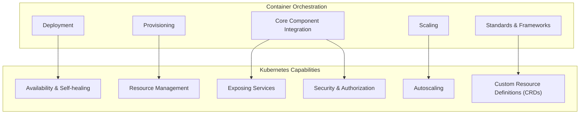
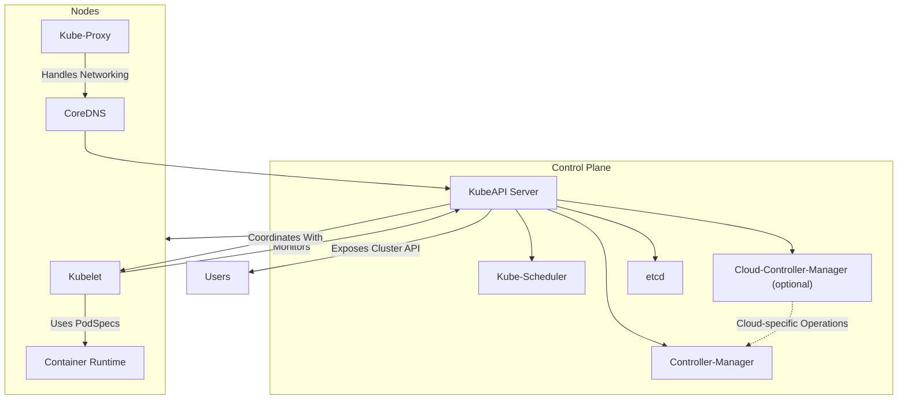

In this installment of this KCNA series, we’ll dive into the fundamentals of Kubernetes and explore how it helps manage containers at scale. Running a few containers can be straightforward, but when dealing with hundreds or thousands of containers, efficient management requires more than basic tools—it needs a sophisticated orchestration platform. This is where Kubernetes excels.

<!--more-->


These notes are a polished version of my personal reflections taken while following along with [this Udemy course](https://www.udemy.com/course/dive-into-cloud-native-containers-kubernetes-and-the-kcna/?couponCode=LETSLEARNNOW) with the great instructor James Spurin. I found that taking meticulous notes while watching the content, combined with discussions with GPT about the topics, greatly enhances my understanding. Thus, some of this content is AI-generated.


---

## Understanding the Role of Container Orchestration



Container orchestration handles critical aspects of deploying and managing containers across multiple environments. Here are some ways container orchestration simplifies and enhances containerized workloads:

- **Provisioning**: Allocating resources and ensuring services have the infrastructure they need.
- **Deployment**: Streamlining how containers are created and run.
- **Scaling**: Managing scaling dynamically to meet demand.
- **Standards and Frameworks**: Ensuring that best practices are consistently applied.
- **Core Component Integration**: Seamlessly integrating with storage, network, and authentication services.

Kubernetes stands out in container orchestration due to its focus on reliability, efficiency, and scalability:

- **Availability and Self-healing**: Automatically restarts failed containers.
- **Resource Management**: Efficiently schedules resources across nodes.
- **Exposing Services**: Manages routing and load-balancing for containerized apps.
- **Security and Authorization**: Integrates security measures for accessing and managing workloads.
- **Autoscaling**: Scales workloads up or down as needed.
- **Custom Resource Definitions (CRDs)**: Extends Kubernetes functionality to manage custom resources.

## Architecture Overview

At its core, Kubernetes follows a client-server architecture, dividing responsibilities between the **Control Plane** and **Nodes**:

- **Control Plane**: Manages the overall state of the cluster.
- **Nodes**: Execute the containers based on instructions from the Control Plane.

In a basic setup, there is one Control Plane and one Node, but Kubernetes supports **high availability** through multiple Control Planes and Nodes. In highly available clusters, `etcd`, the distributed key-value store, employs a [RAFT consensus algorithm](https://raft.github.io/) to synchronize state across nodes.



### Container Runtimes

**Low-level** runtimes handle the core functionality of running containers. They interface with operating system components like Linux **namespaces** and **cgroups** to create isolated environments. `runc` is the main example here:

- **`runc`**: An Open Container Initiative (OCI) runtime, initially created by Docker, which now serves as the reference implementation.
- Other examples include **crun**, **kata-runtime**, and **gVisor**.

A **high-level** runtime, such as `containerd`, manages the entire lifecycle of containers and communicates with the low-level runtime:

- **`containerd`**: Originally developed by Docker and now part of CNCF, `containerd` handles pulling images, storing them, and managing containers through the low-level runtime `runc`.

### Core Components of the Control Plane

#### Kubelet

The **kubelet** runs on both the Control Plane and Nodes, ensuring that the specified containers (called **Pods**) are running on the system:

- It uses **Pod Specifications (PodSpecs)** in YAML or JSON to manage and monitor pod status.
- PodSpecs can be provided via API requests or a designated directory, often `/etc/kubernetes/manifests`.
- Kubelet coordinates with `containerd` and `runc` to create **static pods** essential to the Control Plane.
- It also monitors node health e.g., checking CPU, memory, and storage metrics.

#### Static Pods and Key Control Plane Components

Static pods differ from dynamic pods in that they are defined directly on nodes and aren't managed by the API server. This is why they are central for bootstrapping essential control plane services.

1. **etcd**:

   - A distributed, strongly consistent key-value store.
   - Provides the "source of truth" for cluster state.
   - Supports leader elections and manages data consistency across nodes in highly available clusters.

2. **KubeAPI Server**:

   - Acts as the primary interface to the Control Plane.
   - Provides a RESTful API and manages data stored in `etcd`.
   - Communicates with kubelet and other components to orchestrate pods.

3. **Kube-Scheduler**:

   - Assigns pods to nodes based on resources and constraints.
   - Ensures efficient use of resources, dynamically adjusting to accommodate workloads.

4. **Kube-Proxy**:

   - Runs as a DaemonSet, handling network routing and load-balancing for services.
   - Configures forwarding for TCP, UDP, and SCTP connections across nodes.
   - Uses **iptables** and **IPVS** as underlying tools for networking.

5. **CoreDNS**:

   - A Deployment that handles DNS within the cluster.
   - Ensures that pods and services can resolve each other by name.

6. **Controller-Manager**:

   - Runs various controllers, such as Replication Controller and Node Controller, to maintain desired cluster state.
   - Monitors and enforces resource counts and configurations specified in the cluster.
   - Some of controllers run by Controller-Manager are ReplicaSet Controller, Endpoint Controller, and Service Account Controller.

7. **Cloud-Controller-Manager** (optional):
   - Interfaces with cloud providers to support features like load balancers and persistent storage.
   - Enables seamless integration of Kubernetes with cloud-specific services, typically only found in managed Kubernetes offerings.
   - Cloud-Controller-Manager components like **Route Controller** and **Node Controller** handle node lifecycle management in cloud environment, distinguishing this component from on-premise Kubernetes setups.

## Managing Resources

### Services and Networking

Kubernetes **Services** expose applications running on Pods as network services. There are four main types of services, each serving a specific purpose:

- **Cluster IP**: Exposes the service within the cluster.
- **NodePort**: Exposes the service on each node's IP at a static port.
- **LoadBalancer**: Allocates a load balancer IP to expose services externally.
- **ExternalName**: Maps the service to an external name.

**Headless Services** are also worth noting. They allow direct access to each pod rather than routing through a single IP, which can be helpful for stateful applications that need unique pod identities.

#### Port Forwarding with `kubectl`

Assume we have a pod running an `nginx` server. We can use `kubectl`'s port forwarding feature to expose this pod’s service locally.

```bash
kubectl port-forward pod/nginx 8080:80
```

With this command, the `nginx` server running on port `80` in the pod will be accessible at `http://localhost:8080` on our machine. This feature is incredibly useful for accessing resources running in the cluster without external exposure.

#### Pod-to-Pod Communication

Let's confirm that pods in a Kubernetes cluster can communicate with each other seamlessly. Assuming we have an `nginx` pod running at `http://10.42.2.2`, we can start a `curl` pod to make requests to it:

```bash
kubectl run -it --rm curl --image=curlimages/curl --restart=Never -- http://10.42.2.2
```

This command deploys a temporary pod running `curl` to fetch content from the `nginx` pod. Kubernetes’ internal networking simplifies communication between pods, even across multiple nodes, without complex networking configurations.

### Managing Resources with YAML

While `kubectl` commands are great for quick interactions, Kubernetes relies heavily on **YAML** files for defining configurations in a declarative way.

Let’s create a basic YAML file to define our `nginx` pod. We can generate a sample YAML configuration using `kubectl`:

```bash
kubectl run nginx --image=nginx --dry-run=client -o yaml | tee nginx.yaml
```

`nginx.yaml` will look something like this:

```yaml
apiVersion: v1
kind: Pod
metadata:
  labels:
    run: nginx
  name: nginx
spec:
  containers:
    - image: nginx
      name: nginx
  dnsPolicy: ClusterFirst
  restartPolicy: Always
```

To deploy this pod, we use the **apply** command, which is Kubernetes' preferred way to manage resources.

```bash
kubectl apply -f nginx.yaml
```

#### Combined YAML files

We can extend our pod management capabilities by combining multiple YAML files into one and applying them at once. Suppose we have both an `nginx.yaml` and `ubuntu.yaml` file; we can combine and apply them as follows:

```bash
{ cat nginx.yaml; echo "---"; cat ubuntu.yaml; } | tee combined.yaml
kubectl apply -f combined.yaml
```

Using this combined YAML structure, Kubernetes will handle multiple resources in a single operation.


in YAML, `---` signals a new separate section


#### Creating a Pod with Multiple Containers

Let’s create a pod that includes two containers: an `nginx` web server and a "sidecar" container running a simple loop. This setup can be useful for scenarios like logging or monitoring, where a second container in the same pod supports the main container.

Here’s a sample YAML configuration for a two-container pod:

```yaml
apiVersion: v1
kind: Pod
metadata:
  name: mypod
spec:
  containers:
    - name: webserver
      image: nginx
    - name: sidecar
      image: ubuntu
      args:
        - /bin/sh
        - -c
        - while true; do echo "$(date +'%T') - Hello from the sidecar"; sleep 5; if [ -f /tmp/crash ]; then exit 1; fi; done
  restartPolicy: Always
```

Apply this file:

```bash
kubectl apply -f mypod.yaml
```

With both containers running, we can view pod details with `kubectl get pods` and inspect the logs of each container separately:

```bash
kubectl logs mypod -c sidecar
```

### Pod Lifecycle Management

#### Troubleshooting and Testing with `kubectl exec`

We can use `kubectl exec` to run commands inside containers. Suppose we want to simulate a crash in our sidecar container by creating a specific file:

```bash
kubectl exec -it mypod -c sidecar -- touch /tmp/crash
```

This command will trigger an error in the sidecar container, causing Kubernetes to restart it, as specified by the `Always` restart policy.

To view logs of a previous instance (after a restart), use the `-p` flag:

```bash
kubectl logs mypod -c sidecar -p
```

#### Init Containers

Init Containers run setup scripts or initialization tasks before the main container in a pod starts. They ensure that essential operations, like configuration checks or dependency preparations, are complete before launching the main app.

To see Init Containers in action, let's create a `countdown-pod`:

```yaml
apiVersion: v1
kind: Pod
metadata:
  name: countdown-pod
spec:
  initContainers:
    - name: init-countdown
      image: busybox
      command:
        [
          "sh",
          "-c",
          'for i in \$(seq 120 -1 0); do echo init-countdown: \$i; sleep 1; done',
        ]

  containers:
    - name: main-container
      image: busybox
      command:
        [
          "sh",
          "-c",
          'while true; do count=\$((count + 1)); echo main-container: sleeping for 30 seconds - iteration \$count; sleep 30; done',
        ]
```

To deploy the pod:

```bash
kubectl apply -f countdown-pod.yaml
```

This command sets up an Init Container that counts down from 120, pausing for a second between each count. After the Init Container completes, the main container begins looping every 30 seconds. Use the following command to monitor the logs of the `init-countdown` container until it completes and then the `main-container` logs:

```bash
until kubectl logs pod/countdown-pod -c init-countdown --follow --pod-running-timeout=5m; do sleep 1; done; until kubectl logs pod/countdown-pod -c main-container --follow --pod-running-timeout=5m; do sleep 1; done
```

### Namespaces

Namespaces help organize resources within a Kubernetes cluster, providing logical separation, resource management, and access control. Here’s a quick example of creating and using namespaces.

1. **Create a Namespace**:

   ```bash
   kubectl create namespace mynamespace
   ```

2. **Deploy an Nginx Pod in a Namespace**:

   ```bash
   kubectl -n mynamespace run nginx --image=nginx
   ```

3. **View Pods in a Namespace**:

   ```bash
   kubectl -n mynamespace get pods
   ```

4. **Set Namespace as Default**:
   You can set your default namespace to avoid specifying `-n <namespace>` each time:

   ```bash
   kubectl config set-context --current --namespace=mynamespace
   ```

   Now, commands like `kubectl get pods` will operate within `mynamespace`.

## Deployments, DaemonSets, and Jobs

Kubernetes offers various ways to manage application workloads, providing the flexibility to handle continuous deployments, node-specific processes, and scheduled tasks.

### Continuous and Scheduled Workloads

#### Deployments and ReplicaSet

**Deployments** are essential for managing application updates, ensuring availability, and rolling back if necessary. Deployments also handle creating and maintaining ReplicaSets behind the scenes, which manage the actual pod replicas, simplifying scaling and reliability.

1. **Create a Deployment**:
   This command generates a deployment YAML for an nginx pod, then immediately applies it.

   ```bash
   kubectl create deployment nginx --image=nginx --dry-run=client -o yaml | tee nginx-deployment.yaml | kubectl apply -f -
   ```

2. **Check Deployment**:

   ```bash
   kubectl get deployments
   ```

**Benefits of Deployments**:

- **Replication**: Ensures desired pod count is maintained.
- **Updates**: Phased rollouts prevent downtime.
- **Rollbacks**: Easily revert if issues arise during updates.

Deployments will create a ReplicaSet behind the scenes, which manages the actual pod replicas. This makes scaling and reliability much simpler to handle.

#### Jobs

**Jobs** are Kubernetes objects designed to run a task to completion, whether for batch processing, data crunching,, or other one-off tasks. Jobs allow control over task completion and parallel execution.

1. **Create a Job to Calculate PI**:
   This job uses a Perl container to calculate PI.

   ```bash
   kubectl create job calculatepi --image=perl:5.34.0 -- "perl" "-Mbignum=bpi" "-wle" "print bpi(2000)"
   ```

2. **Watch the Job Progress**:

   ```bash
   watch kubectl get jobs
   ```

3. **View Logs**:
   Get the pod name and view logs to see the job result.

   ```bash
   kubectl get pods -o wide
   kubectl logs calculatepi
   ```

4. **Create YAML Configuration for Parallel Job Execution**:
   With jobs, you can set `completions` and `parallelism` to control how many times a job runs and how many pods run simultaneously. Here’s an example job configuration for calculating PI with multiple completions in parallel:

   ```yaml
   apiVersion: batch/v1
   kind: Job
   metadata:
     name: calculatepi
   spec:
     completions: 20
     parallelism: 5
     template:
       spec:
         containers:
           - command:
               - perl
               - -Mbignum=bpi
               - -wle
               - print bpi(2000)
             image: perl:5.34.0
             name: calculatepi
             resources: {}
         restartPolicy: Never
   ```

5. **Run the Job**:
   Apply the job and watch as multiple pods handle the calculations.
   ```bash
   kubectl apply -f calculatepi.yaml && sleep 1 && watch kubectl get pods -o wide
   ```

Jobs in Kubernetes provide an effective way to run, complete, and repeat tasks as needed.

### DaemonSets and CronJobs

#### DaemonSets

DaemonSets ensure a copy of a pod is running on every node in the cluster. They are ideal for tasks like logging and monitoring agents that need to run across all nodes.

1. **Create a DaemonSet**:
   Here’s an example of a DaemonSet using Fluentd for logging:

   ```yaml
   apiVersion: apps/v1
   kind: DaemonSet
   metadata:
     name: fluentd
   spec:
     selector:
       matchLabels:
         name: fluentd
     template:
       metadata:
         labels:
           name: fluentd
       spec:
         containers:
           - name: fluentd
             image: fluent/fluentd:latest
   ```

2. **Deploy the DaemonSet**:
   ```bash
   kubectl apply -f daemonset.yaml
   ```

#### CronJobs

CronJobs allow you to schedule Jobs in Kubernetes, enabling you to run tasks at specific times, much like a traditional cron job on Unix systems. They’re ideal for tasks like:

- Generating regular reports
- Running maintenance routines
- Scheduling system or data updates

CronJobs offer time-based scheduling that uses the standard Unix CronJob syntax. They create Jobs according to a defined schedule, with options to set completion count, parallelism, and more. If you’re new to cron syntax, [crontab.guru](https://crontab.guru/#5_4_*_*_*) is a handy tool for learning how to define schedules.

**Example**: Below is a CronJob configuration for a daily report task:

```yaml
apiVersion: batch/v1
kind: CronJob
metadata:
  name: daily-report
spec:
  schedule: "0 2 * * *" # Runs every day at 2 AM
  jobTemplate:
    spec:
      template:
        spec:
          containers:
            - name: report
              image: my-report-image:latest
              args: ["generate-report"]
          restartPolicy: OnFailure
```

In this example, Kubernetes runs the job daily at 2 AM, generating reports automatically.

## Configuration Management

When managing configurations and sensitive information in Kubernetes, **ConfigMaps** and **Secrets** provide two distinct approaches, each with a specific purpose: ConfigMaps handle non-sensitive data, while Secrets securely manage sensitive information. Both are essential for separating configuration from application code, enhancing security and reusability.

### ConfigMaps

**ConfigMaps** provide a way to store non-sensitive configuration data in key-value pairs. They make it easy to keep your configuration separate from application code, allowing for flexible and reusable setups. You can create ConfigMaps directly with literal values, from files, or from directories.

#### Creating a ConfigMap with Literal Values

```bash
kubectl create configmap color-configmap --from-literal=COLOR=red --from-literal=KEY=value
```

#### Creating a ConfigMap from a File

Let’s say we save configuration data to a file:

```bash
cat <<EOF > configmap-color.properties
COLOR=red
KEY=value
EOF
```

We can then create a ConfigMap from this file:

```bash
kubectl create configmap color-configmap --from-env-file=configmap-color.properties
```

#### Viewing a ConfigMap:

```bash
kubectl describe configmap color-configmap
```

ConfigMaps are incredibly flexible and can be used in various scenarios, from environment variables to runtime configurations.

### Secrets

While ConfigMaps store non-sensitive data, **Secrets** are intended for storing sensitive information like API keys, passwords, and other confidential data. Kubernetes Secrets are similar to ConfigMaps, but with extra restrictions for handling sensitive information.


Kubernetes Secrets are not encrypted by default; they are base64-encoded. And rely on additional measures to remain confidential. Make sure to secure access to `etcd`, where Secrets are stored. Or consider alternatives for handling highly confidential data.


#### Creating a Secret with Literal Values

Creating a Secret is similar to ConfigMaps, but with a different command:

```bash
kubectl create secret generic color-secret --from-literal=COLOR=red --from-literal=KEY=value
```

This command will create a Secret containing base64-encoded key-value pairs, allowing applications to access sensitive data without hardcoding it into the application code. To inspect the Secret values:

#### Viewing a Secret

To view the contents of a Secret:

```bash
kubectl describe secret color-secret
```

ConfigMaps and Secrets provides an efficient and secure way to manage both configuration data and sensitive information, keeping the application code clean and secure.

## Labels

**Labels** in Kubernetes are crucial for organizing, identifying, and selecting resources. Labels, represented as key-value pairs, can be added to any resource, enabling logical grouping, filtering, and management of related resources. As your cluster environment grows, a consistent labeling strategy will simplify management and allow for efficient resource organization.

### Adding a Label to a Pod

Here’s a basic YAML configuration that adds a `run: nginx` label to a Pod:

```yaml
apiVersion: v1
kind: Pod
metadata:
  name: nginx
  labels:
    run: nginx
spec:
  containers:
    - name: nginx
      image: nginx
      ports:
        - containerPort: 80
```

Applying this configuration with:

```bash
kubectl apply -f nginx-pod.yaml
```

To list all resources with a specific label, use the selector flag:

```bash
kubectl get all --selector run=nginx
```

A clear labeling strategy helps keep your Kubernetes environment organized and manageable, especially as your resources grow.

## Best Practices for Resource Management

When managing Kubernetes resources, consider these approaches:

- **Declarative over Imperative**: Use `apply` instead of `create`, as `apply` is declarative and compares the current cluster state with the desired state.
- **Separate Configurations into YAML Files**: Modular YAML files make it easier to update, track, and manage resources individually or in groups.
- **Utilize `kubectl` Commands**: Leverage `kubectl explain` to explore available configurations for different resource types and fields:

  ```bash
  kubectl explain pod.spec.dnsPolicy
  ```

## Conclusion

This turned in to a long post and we're only scratching the surface of this behemoth, but these hands-on examples should help you feel comfortable deploying and managing basic resources. In the next post, we’ll go deeper into exciting subjects like, the Kubernetes API, RBAC, Scheduling, Helm and more.
