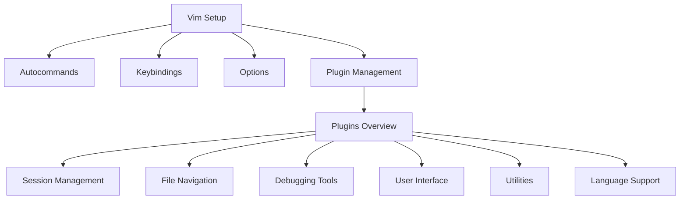

Ever since I was first introduced to Vim in University, I've been captivated by its philosophy. The idea of a highly efficient, **keyboard-centric** editor intrigued me, especially its intricate and well-thought-out **keybinding** system.

<!--more-->

However, like many, I struggled to make Vim my primary editor, frequently falling back on IDEs to get real work done. My Vim journey was far from smooth, but over time, it's become an essential tool that I wouldn’t trade for anything.

---

## The Early Days

I started using Vim with the typical `.vimrc` configuration mess—random snippets of copied configurations that I didn’t fully understand. My setup was disorganized, and my workflow was far from **efficient.**

Looking back at that early config now, I cringe, but it’s also a reminder of how far I’ve come. For anyone starting with Vim, know that it takes time, but persistence pays off.



When I started my first job in tech, I was determined to make Vim my main editor. I wanted to master it while balancing the demands of delivering quality software. Initially, Vim **slowed** me down, mostly because I was not using it to its full potential. I took some heat from my colleagues for how slow I seemed while fumbling around in my terminal, compared to their slick IDE workflows. But, I pushed on, knowing that forcing myself to use Vim for real work was the only way to improve.

## Getting Better, Faster

Once I fully committed to using Vim at work, I started to improve rapidly. Vim became less of a tool that slowed me down and more of an extension of how I thought about code. Now, when my colleagues see me navigate projects using **only my keyboard**, they often express a bit of curiosity. The initial effort was significant, but the payoff has been immense.

Vim's keybinding system is so ingrained in my workflow now that even outside of Vim, I rely on it. Fortunately, a wide array of tools and applications have embraced Vim keybindings, which means you don't even need to use Vim in the terminal to benefit from them, in fact, before making the full-on switch to vim in the terminal I used a vscode extension to mimic some of the behaviors of vim. I even wrote a separate [blog post](../vim-motions) that more specifically deals with the matters of these useful keybinds known as **vim motions**.

Here are just a few tools that incorporate Vim keybindings in one way or another and are part of my daily workflow:

- **Vimium** (Browser extension for keyboard-based browsing)
- **Hammerspoon** (Automation on macOS)
- **Karabiner** (Key remapping on macOS)
- **Homerow** (macOS keyboard navigation)
- **tmux** (Terminal multiplexer)
- **AltTab** (Window management)
- **IDE Extensions** for:
  - VSCode
  - IntelliJ

The combination of these tools and Vim keybindings lets me navigate my entire computer using just the keyboard—it's **amazing**. I intend to go more in-depth into many of these components in future posts here!

## Keybindings: A Gamer's Edge

As a gamer, especially in games like _World of Warcraft_ where everything is bound to keys, my drive for **efficiency** carried over into my professional life. Why should my software engineering environment be any different from my gaming setup? The **default** Vim keybindings are powerful, and I maintain all the standard ones because they form the backbone of efficient navigation and editing.

### Using the Leader Key for Custom Bindings

To enhance my workflow, I leverage the **leader key**—a customizable key that acts as a prefix for my custom bindings. This approach allows me to keep all the standard Vim keybindings intact while still adding functionality tailored to my specific needs. The leader key serves as a **gateway** to my personal shortcuts, enabling me to perform actions quickly and efficiently.

Here are some of the custom bindings I use with the leader key:

- **Leader + f**: Opens fuzzy finder with `ripgrep` to quickly search file contents.
- **Leader + p**: Opens fuzzy finder search file by name.
- **Leader + gd**: Triggers LSP go-to-definition
- **Leader + r**: Rename LSP symbol
- **Leader + a**: Add position to quick-fix list.

I know many people opt to use only double character binds with leader key grouping them in a logical way, `Telescope` binds would be like `<leader> tf` or `<leader> tp` where the first letter indicates relevant plugin. The reason is that this way, running into conflicting keybinds is less likely, I see the point but I have yet to run into issues because of this, so for now I'm sticking with what works for me.

By keeping the default keybindings intact, I can still rely on the foundational shortcuts that many Vim users are familiar with. This way, I can switch between different environments and remain efficient, without needing to relearn basic commands. My custom bindings enhance my workflow without overwhelming it, allowing me to stay focused on the task at hand.

### A Minimalistic Yet Powerful Approach

Using the leader key strategy aligns perfectly with my philosophy of **minimalism**. While I have around **38 plugins** installed, each one addresses a specific problem. Similarly, my custom keybindings serve to streamline my workflow without adding clutter. I aim for a setup that maximizes my **efficiency**, allowing me to focus on coding rather than fumbling with controls.

Sure, IDEs like VSCode _"just work"_ out of the box, and there's value in that. However, the process of setting up and maintaining my Neovim environment has taught me invaluable lessons about the tools I use daily. Even if I eventually go back to an IDE for convenience, the time I’ve spent mastering Neovim will have been well worth it.

In summary, using the leader key for custom bindings has enabled me to build a keyboard-centric workflow that feels intuitive and responsive. The combination of standard Vim keybindings and my curated set of shortcuts ensures that I can navigate my codebase and tools with confidence and speed.

## Conclusion

This might feel like a rant, but I needed to get this off my chest. My journey with Vim and Neovim has been one of trial and error, but the rewards have been incredible. The learning curve is **steep**, but the efficiency and control you gain are unmatched. If you’re considering committing to Vim or Neovim, my advice is simple: stick with it. The initial hurdles are high, but once you’re on the other side, you’ll never look back.

Mastering Vim/Neovim requires _commitment_, but the flexibility and power it provides make the journey worthwhile. Even if you use a more traditional IDE, just knowing Vim keybindings can drastically improve your efficiency across many tools and applications. For me, the Vim philosophy isn't just about editing code—it's about unlocking a keyboard-first approach to working with my computer.
